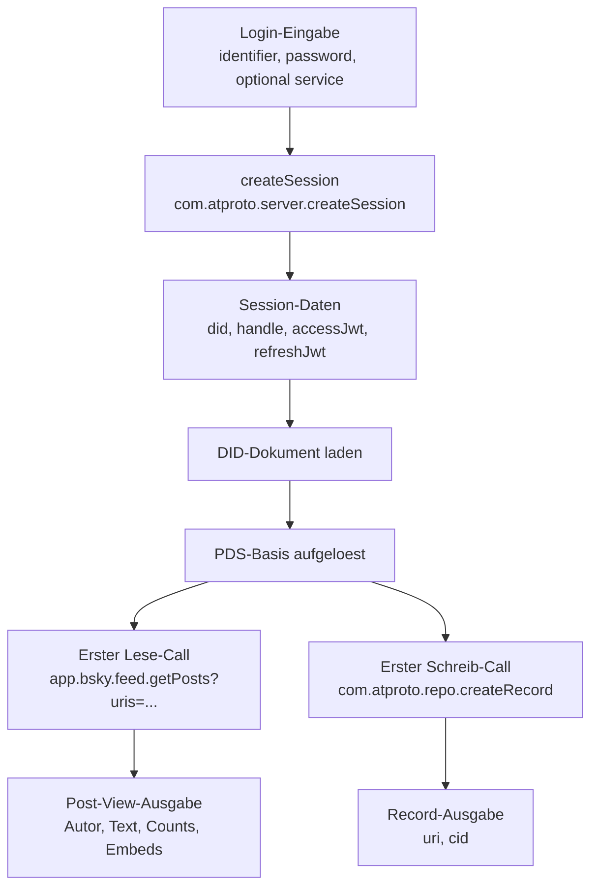

# AT-Protocol-Hinweise

**Deutsch** | [English](ATPROTO.md)

Diese Datei sammelt die AT-Protocol- und Bluesky-spezifischen Teile, die zuvor in `TECHNICAL.de.md` standen.

## Zweck

Threadline bleibt eine statische Browser-App, aber die eigentliche Protokollschicht liegt jetzt in einer eigenen Service-Worker-Hilfsdatei:

- `sw-atproto.js`
  - AT-Protocol-Transport, Auth/Session-Refresh, DID/PDS-Aufloesung, Blob-Zugriffe und URI-Helfer
- `sw.js`
  - Workspace-Logik, Caching, Archivlaeufe und UI-nahe Service-Worker-Befehle

## Endpunkt-Modell

Der groesste Teil des AT-Protocol-Verkehrs in Threadline ist normales XRPC:

- Login und Refresh
  - `com.atproto.server.createSession`
  - `com.atproto.server.refreshSession`
  - `com.atproto.server.describeServer`
- Identity- und DID-Aufloesung
  - `com.atproto.identity.resolveHandle`
  - DID-Dokument-Lookups fuer `did:plc` und `did:web`
- Repo-Schreiben und Repo-Lesen
  - `com.atproto.repo.createRecord`
  - `com.atproto.repo.getRecord`
  - `com.atproto.repo.listRecords`
  - `com.atproto.repo.uploadBlob`
  - `com.atproto.sync.getBlob`
- Bluesky-App-Views
  - `app.bsky.actor.getProfile`
  - `app.bsky.actor.searchActorsTypeahead`
  - `app.bsky.feed.searchPosts`
  - `app.bsky.feed.getAuthorFeed`
  - `app.bsky.feed.getPosts`
  - `app.bsky.feed.getPostThread`
  - `app.bsky.notification.listNotifications`
  - `app.bsky.graph.getFollowers`
  - `app.bsky.graph.getFollows`
- Chat-Proxy-Calls
  - `chat.bsky.convo.listConvos`
  - `chat.bsky.convo.getMessages`

## Login, DID Und PDS-Aufloesung

Threadline geht bewusst nicht davon aus, dass jedes Konto auf `bsky.social` liegt.

1. Der gewaehlte Service wird auf eine sichere HTTPS-Basis normalisiert.
2. `createSession` liefert DID, Handle und JWTs.
3. Das DID-Dokument wird geladen.
4. Daraus wird der Personal Data Server extrahiert.
5. Spaetere authentifizierte Requests bevorzugen diese echte PDS-Basis statt eines hart codierten Standardhosts.

Das ist besonders wichtig fuer:

- eigene PDS-Server
- `eurosky.social`
- Mu.social als Web-Frontend
- Archiv- und Blob-Calls, die den Ursprungshost treffen muessen

## Einfache Ablaufgrafik

## Beispielhafter Durchlauf

| Schritt | Call oder gespeicherter Zustand | Wichtige Eingabe | Typische Ausgabe |
| --- | --- | --- | --- |
| 1 | Login-Formular | `identifier`, `password`, optionale Service-URL | nur rohe Nutzereingabe |
| 2 | `com.atproto.server.createSession` | dieselben Zugangsdaten | DID, Handle, `accessJwt`, `refreshJwt` |
| 3 | Lokaler Session-Zustand | Session plus gewaehlter Service | Threadline speichert DID, Handle, Service, PDS, Web-App, Avatar und Session-Tokens lokal |
| 4 | DID-Dokument-Lookup | DID aus der Session | Endpunkt des Personal Data Server |
| 5 | Erstes Lese-Beispiel: `app.bsky.feed.getPosts` | eine oder mehrere Post-URIs in `uris[]` | Post-Views mit Autor, Record-Inhalt, Embeds und Counts |
| 6 | Erstes Schreib-Beispiel: `com.atproto.repo.createRecord` | `repo`, `collection`, `record` | angelegter Record-Deskriptor mit neuer URI und CID |

## Session-Speicherung Und Dauer

| Thema | Einfache Erklaerung |
| --- | --- |
| Was Threadline speichert | DID, Handle, gewaehlter Service, aufgeloeste PDS, oeffentliche Web-App, Avatar-URL, `accessJwt`, `refreshJwt` und weitere lokale Kontometadaten |
| Wo es gespeichert wird | Im Browser ueber die lokale persistente Speicherung des Service Workers |
| Wie lange das gilt | Es gibt hier keine einzelne feste Dauer, auf die sich Threadline verlassen kann. Das `accessJwt` ist kurzlebig und wird bei Bedarf erneuert. |
| Wofuer `refreshJwt` da ist | Damit kann Threadline ein frisches `accessJwt` holen, ohne jedes Mal einen manuellen Login zu verlangen |
| Wann ein neuer Login noetig wird | Wenn das Refresh fehlschlaegt, kein App-Passwort gespeichert ist oder die entfernte Session nicht mehr akzeptiert wird |

## Zentrale Begriffe

| Begriff | Einfache Bedeutung | Wofuer Threadline das nutzt |
| --- | --- | --- |
| `JWT` | Ein signiertes Login-Token. Ein solches Token beweist, dass der Nutzer gerade angemeldet ist. | Threadline sendet `accessJwt` bei authentifizierten Requests und nutzt `refreshJwt`, um abgelaufene Sessions zu erneuern. |
| `DID` | Eine stabile dezentrale Kennung fuer ein Konto oder einen Dienst. Anders als ein Handle soll sie auch bei Namensaenderungen stabil bleiben. | Threadline nutzt DIDs fuer Konten, PDS-Aufloesung sowie zum sicheren Adressieren von Records und Blobs. |
| `CID` | Eine Content-ID. Sie steht fuer genau eine bestimmte Inhaltsversion, zum Beispiel eines Blobs oder Record-Inhalts. | Threadline nutzt CIDs vor allem bei Blob-Downloads und bei Record-Metadaten aus Repo-Endpunkten. |
| `Record` | Ein einzelnes gespeichertes Datenobjekt im AT-Protocol-Repo. Ein Post, Follow, Like, Threadgate oder Postgate ist jeweils ein Record. | Threadline legt Records an, liest sie aus und listet sie beim Posten, Archivieren und bei Beziehungspruefungen. |
| `Repo` | Das persoenliche AT-Protocol-Datenrepo eines Kontos. Das ist kein Git-Repository. | Threadline liest und schreibt darin Posts, Gates und andere kontobezogene Daten. |
| `Avatar` | Die Profilbild-URL eines Kontos. Technisch ist das Profildateninhalt, der oft auf ein blobbasiertes Medium zeigt. | Threadline laedt Avatare fuer Karten, cached sie lokal und nutzt sie teils auch fuer Archiv- und Exportausgaben. |

## Was In Einem Record Steckt

Ein Record ist der eigentliche gespeicherte Inhalt. Je nach Collection kann er enthalten:

- Identitaetsfelder
  - zum Beispiel Autor-DID oder verlinkte Kontoreferenzen
- Zeitstempel
  - zum Beispiel `createdAt`
- typisierte Nutzdaten
  - Post-Text, Reply-Referenzen, Embeds, Sprach-Tags, Hashtags oder Moderationsregeln
- Medien-Referenzen
  - Blob-Referenzen fuer hochgeladene Bilder
- Protokoll-Typisierung
  - meistens ein `$type` wie `app.bsky.feed.post`

Wichtig ist die Unterscheidung zwischen:

- Record-Inhalt
  - der eigentliche gespeicherte Nutzinhalt
- Record-Huelle
  - Metadaten darum herum wie URI und CID aus Repo-Endpunkten

## Repo- Und Blob-Verhalten

Threadline schreibt echte Records in das Account-Repo:

- Posts als `app.bsky.feed.post`
- optionale Antwortregeln als `app.bsky.feed.threadgate`
- optionale Quote-Regeln als `app.bsky.feed.postgate`

Blob-Behandlung ist in zwei Faelle aufgeteilt:

- Upload fuer das aktuelle Konto
  - `com.atproto.repo.uploadBlob`
- oeffentlicher oder hostuebergreifender Download
  - `com.atproto.sync.getBlob`
  - bei Bedarf erst nach DID-zu-PDS-Aufloesung

## Zuordnung Nach Workspaces

Die Workspaces greifen unterschiedlich auf dieselbe AT-Protocol-Schicht zu:

- Composer
  - schreiblastig, nutzt Handle-Aufloesung, Mention-Typeahead, Blob-Upload, `createRecord` und gezielte Post-/Thread-Lookups
- Suche
  - kombiniert `searchPosts` fuer globale Suche und `getAuthorFeed` fuer lokale Durchlaeufe ueber Account-Posts oder Reposts
- Archiv
  - seitenlastig, nutzt `listRecords`, `getPostThread`, `getPosts` und Blob-Downloads
- Analyse
  - leselastig, nutzt vor allem Profile, Author-Feed und Graph-Endpunkte
- Netzwerk
  - kombiniert Graph-Endpunkte, Profilaufrufe und einzelne Record-Lookups
- DM-Archiv
  - nutzt `chat.bsky.convo.*` ueber den Chat-Proxy-Header

## Pages Und Cursor

Threadline verwendet das Wort "Page" in mehreren Bedeutungen:

- API-Page
  - eine cursorbasierte Antwortseite aus AT Protocol oder Bluesky
- UI-Page
  - ein sichtbarer Nachladezustand wie "mehr laden"
- Dokumentseite
  - eine spaetere HTML- oder PDF-Exportseite

Faustregel:

- wenn ein Endpunkt einen `cursor` liefert, ist eine API-Page gemeint
- wenn die UI eine weitere Welle oder Fortsetzung zeigt, kann das mehrere API-Pages zusammenfassen
- wenn ein Export gerendert wird, geht es um Dokumentseiten

## Schnittstellen-Synopsen

Dieser Abschnitt buendelt drei Dinge:

- zwei sehr kleine Beispielablaeufe
- die Rueckgabeformen in einfacher Sprache
- die Endpunkt-Synopsen pro Call

### Zwei Typische Mini-Ablaufe

### Einen bekannten Post lesen

| Schritt | Was passiert | Eingabe | Ausgabe |
| --- | --- | --- | --- |
| 1 | Nutzer ist bereits eingeloggt | gespeicherte Session | gueltiger Bearer-Token |
| 2 | Threadline ruft `app.bsky.feed.getPosts` auf | `uris[]` | Liste aufgeloester Post-Views |
| 3 | Die UI rendert das Ergebnis | Post-View-Felder | Autorname, Avatar, Text, Embeds, Counts |

### Einen neuen Post veroeffentlichen

| Schritt | Was passiert | Eingabe | Ausgabe |
| --- | --- | --- | --- |
| 1 | Optionaler Medien-Upload | Binaerdatei, Content-Type | Blob-Referenz |
| 2 | Threadline baut einen Post-Record | Text, Reply-Info, Facets, Embeds, Sprachen | `app.bsky.feed.post` als Record-Inhalt |
| 3 | Threadline ruft `com.atproto.repo.createRecord` auf | `repo`, `collection`, `record` | neue Post-URI und CID |
| 4 | Die UI speichert das Ergebnis in der Historie | angelegter Record-Deskriptor | klickbarer Post-Link und lokaler Historieneintrag |

### Rueckgabeformen In Einfacher Sprache

| Begriff | Was das praktisch bedeutet | Typischer Inhalt |
| --- | --- | --- |
| Record-Seite | Eine cursorbasierte Seite gespeicherter Repo-Records | `records[]`, optional `cursor`, pro Eintrag meist URI, CID und gespeicherter Wert |
| Profil-View | Ein anzeigefertiger Kontostand | DID, Handle, Anzeigename, Avatar-URL, Counts, Viewer-Beziehungsflags |
| Follower-Seite | Eine Seite mit Konten, die einem Zielkonto folgen | `followers[]`, optional `cursor`, actor-aehnliche Profileintraege |
| Following-Seite | Eine Seite mit Konten, denen ein Zielkonto folgt | `follows[]`, optional `cursor`, actor-aehnliche Profileintraege |
| Author-Feed-Seite | Eine Seite mit Post-Views aus dem Feed eines Kontos | `feed[]`, optional `cursor`, pro Eintrag meist ein Post plus Kontext |
| Aufgeloeste Post-Views | Anzeigeobjekte fuer bereits bekannte Post-URIs | Post-URI, CID, Autor, Record-Inhalt, Counts, Embeds, Viewer-Metadaten |
| Thread-Baum | Eine verschachtelte Gespraechsstruktur rund um einen Post | Startpost, Parent-Kette, Replies, Autoren- und Embed-Views |
| Notification-Seite | Eine Seite mit Konto-Benachrichtigungen | `notifications[]`, optional `cursor`, Grund, Autor, verlinkter Post oder Record |
| Konversations-Seite | Eine Seite mit DM-Konversations-Uebersichten | `convos[]`, optional `cursor`, Partnerliste, letzte Nachricht, Zeitstempel |
| Nachrichten-Seite | Eine Seite mit Nachrichten aus genau einer DM-Konversation | `messages[]`, optional `cursor`, Absender, Text, Anhaenge, Zeitstempel |

### `com.atproto.server.createSession`

| Feld | Beschreibung |
| --- | --- |
| Parameter | `identifier`, `password`, optionale Service-Basis |
| Rueckgabe | Session-Objekt mit DID, Handle, `accessJwt`, `refreshJwt` |
| Warum wichtig | Startpunkt fuer authentifiziertes Posten, Archiv, Analyse und DM-Zugriff |

### `com.atproto.server.refreshSession`

| Feld | Beschreibung |
| --- | --- |
| Parameter | gueltiges `refreshJwt` |
| Rueckgabe | erneuerte Session, meist mit neuem Access-Token |
| Warum wichtig | Haelt lange Prozesse am Leben, ohne den Nutzer neu einloggen zu lassen |

### `com.atproto.identity.resolveHandle`

| Feld | Beschreibung |
| --- | --- |
| Parameter | Handle wie `name.bsky.social` |
| Rueckgabe | aufgeloeste DID |
| Warum wichtig | Macht aus sichtbaren Namen stabile Protokollkennungen |

### `com.atproto.repo.listRecords`

| Feld | Beschreibung |
| --- | --- |
| Parameter | `repo`, `collection`, optional `limit`, optional `cursor` |
| Rueckgabe | Record-Seite plus optionaler naechster Cursor |
| Was steckt drin | Meist `records[]`; pro Eintrag oft URI, CID und gespeicherter Wert |
| Warum wichtig | Rueckgrat fuer Archivexporte und recordbasierte Durchlaeufe |

### `com.atproto.repo.getRecord`

| Feld | Beschreibung |
| --- | --- |
| Parameter | `repo`, `collection`, `rkey` |
| Rueckgabe | einzelner Record mit URI, CID und gespeichertem Wert |
| Was steckt drin | Der eigentliche Record-Inhalt, zum Beispiel ein Follow- oder Post-Record |
| Warum wichtig | Threadline nutzt das fuer gezielte Nachschlaege wie Beziehungsdaten oder Post-Metadaten |

### `com.atproto.repo.createRecord`

| Feld | Beschreibung |
| --- | --- |
| Parameter | `repo`, `collection`, `record` |
| Rueckgabe | angelegter Record-Deskriptor |
| Was steckt drin | Meist die neue URI und CID des angelegten Records |
| Warum wichtig | Damit entstehen Posts, Threadgates und Postgates |

### `com.atproto.repo.uploadBlob`

| Feld | Beschreibung |
| --- | --- |
| Parameter | Binaerdaten, Content-Type |
| Rueckgabe | Blob-Referenz |
| Was steckt drin | Ein Blob-Deskriptor, der spaeter in einen Post eingebettet werden kann |
| Warum wichtig | So werden Bilder zu anhaengbaren Medien |

### `com.atproto.sync.getBlob`

| Feld | Beschreibung |
| --- | --- |
| Parameter | DID, CID |
| Rueckgabe | rohe Blob-Bytes |
| Was steckt drin | Die echten Dateibytes plus HTTP-Content-Type |
| Warum wichtig | Wird fuer Downloads, Archivexporte, gecachte Avatare und Bild-Hydration genutzt |

### `app.bsky.actor.getProfile`

| Feld | Beschreibung |
| --- | --- |
| Parameter | Actor-DID oder Handle |
| Rueckgabe | Profil-View |
| Was steckt drin | DID, Handle, Anzeigename, Avatar-URL, Beschreibung, Counts, Viewer-Beziehungsinfos |
| Warum wichtig | Liefert Anzeigedaten fuer Karten, Avatare, Archivkontext und Analyse |

### `app.bsky.actor.searchActorsTypeahead`

| Feld | Beschreibung |
| --- | --- |
| Parameter | Suchtext `q`, optional `limit` |
| Rueckgabe | Kurze, sortierte Actor-Liste |
| Was steckt drin | Einfache Profilansichten mit DID, Handle, Anzeigename, Avatar und Viewer-Beziehungsinfos |
| Warum wichtig | Threadline nutzt das fuer Account-Autocomplete im Mention-Reparatur-Popup und spaeter fuer wiederverwendbare Account-Picker |

### `app.bsky.graph.getFollowers`

| Feld | Beschreibung |
| --- | --- |
| Parameter | Actor, optional `limit`, optional `cursor` |
| Rueckgabe | Follower-Seite |
| Was steckt drin | Eine Seite actor-aehnlicher Profileintraege, die Follower darstellen |
| Warum wichtig | Wird von Netzwerk- und Analyse-Workspace genutzt |

### `app.bsky.graph.getFollows`

| Feld | Beschreibung |
| --- | --- |
| Parameter | Actor, optional `limit`, optional `cursor` |
| Rueckgabe | Following-Seite |
| Was steckt drin | Eine Seite actor-aehnlicher Profileintraege, die gefolgte Konten darstellen |
| Warum wichtig | Wird von Netzwerk- und Analyse-Workspace genutzt |

### `app.bsky.feed.searchPosts`

| Feld | Beschreibung |
| --- | --- |
| Parameter | Suchtext plus optional `author`, `tag`, `lang`, `domain`, `url`, `mentions`, `sort`, `since`, `until`, optional `limit`, optional `cursor` |
| Rueckgabe | Suchergebnis-Seite |
| Was steckt drin | `posts[]` als bereits aufgeloeste Post-Views plus optionaler naechster Cursor |
| Warum wichtig | Rueckgrat der globalen Live-Suche im Suche-Workspace |

### `app.bsky.feed.getAuthorFeed`

| Feld | Beschreibung |
| --- | --- |
| Parameter | Actor, optional `limit`, optional `cursor` |
| Rueckgabe | Author-Feed-Seite |
| Was steckt drin | Feed-Eintraege mit Post-View, Autorendaten, Counts, Embeds und Cursor |
| Warum wichtig | Zentrale Quelle fuer Analyse, Archivscans, letzte Posts und Threadlines lokale Suchmodi fuer Account-Posts und Reposts |

### `app.bsky.feed.getPosts`

| Feld | Beschreibung |
| --- | --- |
| Parameter | URI-Liste |
| Rueckgabe | aufgeloeste Post-Views |
| Was steckt drin | Anzeigeobjekte fuer genaue URIs, inklusive Autor, Record, Embeds und Counts |
| Warum wichtig | Praktisch, wenn Threadline bereits genau weiss, welche Posts gemeint sind |

### `app.bsky.feed.getPostThread`

| Feld | Beschreibung |
| --- | --- |
| Parameter | Startpost-URI, optionale Tiefenoptionen |
| Rueckgabe | Thread-Baum |
| Was steckt drin | Ein Post als Einstieg plus Eltern und Replies als verschachtelte Gespraechsstruktur |
| Warum wichtig | Wird fuer Thread-Fortsetzung, Reply-Pruefung, Archiv-Erweiterung und Kontextansicht genutzt |

### `app.bsky.notification.listNotifications`

| Feld | Beschreibung |
| --- | --- |
| Parameter | optional `limit`, optional `cursor` |
| Rueckgabe | Notification-Seite |
| Was steckt drin | Benachrichtigungen mit Grund, Quell-Actor, Zeitstempel und oft verlinktem Post oder Record |
| Warum wichtig | Threadline nutzt das fuer netzwerk- und interaktionsnahe Ansichten wie Likes auf Posts |

### `chat.bsky.convo.listConvos`

| Feld | Beschreibung |
| --- | --- |
| Parameter | optional `limit`, optional `cursor` |
| Rueckgabe | Konversations-Seite |
| Was steckt drin | DM-Uebersichten mit Teilnehmern, Vorschau der letzten Nachricht und Aktualisierungszeit |
| Warum wichtig | Das ist die Einstiegsliste fuer den DM-Archiv-Workspace |

### `chat.bsky.convo.getMessages`

| Feld | Beschreibung |
| --- | --- |
| Parameter | `convoId`, optional `limit`, optional `cursor` |
| Rueckgabe | Nachrichten-Seite |
| Was steckt drin | DM-Nachrichten mit Absender, Text, Zeitstempeln und moeglichen Anhaengen |
| Warum wichtig | Damit exportiert Threadline nach der Konversationsliste die eigentlichen Gespraechsinhalte |

## Offizielle Limits

Fuer `app.bsky.feed.post` definiert das kanonische Lexicon derzeit beide Werte:

- `maxGraphemes: 300`
- `maxLength: 3000`

Im echten Posting-Verhalten ist fuer Nutzer vor allem das Graphem-Limit wichtig:

- Bluesky zaehlt sichtbare Graphem-Cluster, nicht einfach JavaScript-Stringlaenge
- komplexe Emojis koennen ein sichtbares Zeichen, aber viele Codepoints oder Bytes sein
- CJK-Text zaehlt sichtbares Zeichen fuer sichtbares Zeichen in dasselbe `300`-Limit

Ein separat dokumentiertes Gesamtzeichenlimit fuer den ganzen Thread gibt es in den offiziellen AT-Protocol- oder Bluesky-Dokumenten nicht. Ein Thread ist technisch eine Antwortkette einzelner `app.bsky.feed.post`-Records, verknuepft ueber:

- `reply.root`
- `reply.parent`

## Zugehoerige Protokoll-Quellen

- [AT Protocol Docs](https://atproto.com/docs)
- [AT Protocol Specification](https://atproto.com/specs/atp)
- [Lexicon Specification](https://atproto.com/specs/lexicon)
- [AT Protocol XRPC API Reference](https://docs.bsky.app/docs/api/at-protocol-xrpc-api)
- [ATProto-Lexicon fuer `app.bsky.feed.post`](https://raw.githubusercontent.com/bluesky-social/atproto/main/lexicons/app/bsky/feed/post.json)
