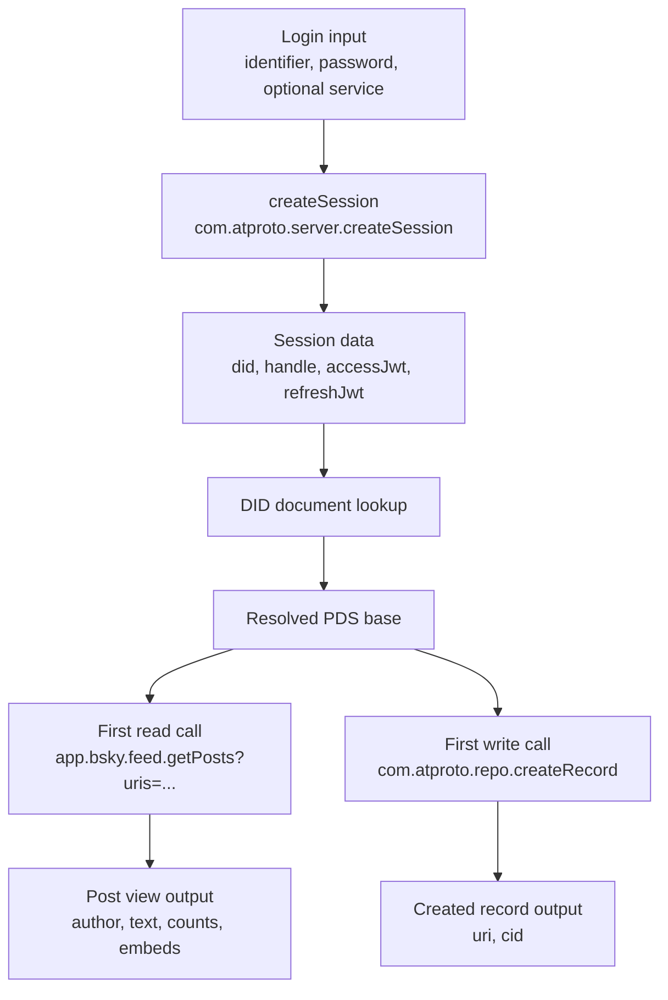

# AT Protocol Notes

[Deutsch](ATPROTO.de.md) | **English**

This document collects the AT Protocol and Bluesky-specific parts that used to live inside `TECHNICAL.md`.

## Purpose

Threadline is still a static browser app, but its network layer now lives in a dedicated service-worker helper file:

- `sw-atproto.js`
  - AT Protocol transport, auth/session refresh, DID/PDS resolution, blob access, and URI helpers
- `sw.js`
  - workspace logic, caching, archive workflows, UI-facing service-worker commands

## Endpoint Model

Most AT Protocol traffic in Threadline is plain XRPC:

- login and refresh
  - `com.atproto.server.createSession`
  - `com.atproto.server.refreshSession`
  - `com.atproto.server.describeServer`
- identity and DID resolution
  - `com.atproto.identity.resolveHandle`
  - DID document lookup through `did:plc` and `did:web`
- repo writes and reads
  - `com.atproto.repo.createRecord`
  - `com.atproto.repo.getRecord`
  - `com.atproto.repo.listRecords`
  - `com.atproto.repo.uploadBlob`
  - `com.atproto.sync.getBlob`
- Bluesky app views
  - `app.bsky.actor.getProfile`
  - `app.bsky.feed.getAuthorFeed`
  - `app.bsky.feed.getPosts`
  - `app.bsky.feed.getPostThread`
  - `app.bsky.notification.listNotifications`
  - `app.bsky.graph.getFollowers`
  - `app.bsky.graph.getFollows`
- chat proxy calls
  - `chat.bsky.convo.listConvos`
  - `chat.bsky.convo.getMessages`

## Login, DID, And PDS Resolution

Threadline does not assume that every account lives on `bsky.social`.

1. The selected service is normalized to a secure HTTPS base.
2. `createSession` returns DID, handle, and JWTs.
3. The DID document is loaded.
4. The Personal Data Server endpoint is extracted from the DID document.
5. Later authenticated calls prefer the resolved PDS over a hard-coded default host.

That is especially important for:

- custom PDS servers
- `eurosky.social`
- Mu.social as web frontend
- archive and blob calls that must hit the original host

## Simple Flow Graphic

## Example Walkthrough

| Step | Call or stored state | Important input | Typical output |
| --- | --- | --- | --- |
| 1 | Login form | `identifier`, `password`, optional service URL | Raw user input only |
| 2 | `com.atproto.server.createSession` | same credentials | DID, handle, `accessJwt`, `refreshJwt` |
| 3 | Local session state | session plus chosen service | Threadline stores DID, handle, service, PDS, web app, avatar, and the session tokens locally |
| 4 | DID document lookup | DID from session | Personal Data Server endpoint |
| 5 | First read example: `app.bsky.feed.getPosts` | one or more post URIs in `uris[]` | post views with author, record payload, embeds, and counts |
| 6 | First write example: `com.atproto.repo.createRecord` | `repo`, `collection`, `record` | created record descriptor with new URI and CID |

## Session Storage And Duration

| Topic | Simple explanation |
| --- | --- |
| What Threadline stores | DID, handle, chosen service, resolved PDS, public web app, avatar URL, `accessJwt`, `refreshJwt`, and some local account metadata |
| Where it is stored | In the browser, through the service worker's local persistent storage |
| How long it lasts | There is no single fixed duration documented here that Threadline can rely on. The `accessJwt` is short-lived and Threadline refreshes it when needed. |
| What `refreshJwt` is for | It lets Threadline request a fresh `accessJwt` without forcing a manual login every time |
| When login is needed again | When refresh fails, the app password is missing, or the remote session is no longer accepted |

## Core Terms

| Term | Plain-language meaning | What Threadline uses it for |
| --- | --- | --- |
| `JWT` | A signed login token. One token proves that the user is currently logged in. | Threadline sends `accessJwt` with authenticated requests and uses `refreshJwt` to renew expired sessions. |
| `DID` | A stable decentralized identifier for an account or service. Unlike a handle, it is meant to stay stable even when names change. | Threadline uses DIDs to identify accounts, resolve the correct PDS, and address records and blobs safely. |
| `CID` | A content identifier. It points to one exact content version, such as a blob or record payload. | Threadline uses CIDs mainly for blob downloads and for record metadata returned by repo endpoints. |
| `Record` | One stored data object in an AT Protocol repo. A post, follow, like, threadgate, or postgate is a record. | Threadline creates, reads, and lists records while posting, archiving, and checking relationships. |
| `Repo` | The personal AT Protocol data repository of one account. It is not a Git repository. | Threadline reads and writes posts, gates, and related account data in this repo. |
| `Avatar` | The profile image URL shown for an account. Technically it is profile data that often points to a blob-backed media asset. | Threadline loads avatars for UI cards, caches them locally, and sometimes re-downloads them for archive/export output. |

## What A Record Contains

A record is the stored payload itself. Depending on the collection, it can contain:

- identity fields
  - for example author DID or linked account references
- timestamps
  - for example `createdAt`
- typed payload data
  - post text, reply references, embeds, language tags, hashtags, or moderation rules
- media references
  - blob references for uploaded images
- protocol typing
  - usually a `$type` field such as `app.bsky.feed.post`

The important distinction is:

- the record payload
  - the actual stored content
- the record envelope
  - metadata around it such as URI and CID returned by repo endpoints

## Repo And Blob Behavior

Threadline writes real records into the account repo:

- posts are created as `app.bsky.feed.post`
- optional reply restrictions become `app.bsky.feed.threadgate`
- optional quote restrictions become `app.bsky.feed.postgate`

Blob handling is split into two cases:

- current-account upload
  - `com.atproto.repo.uploadBlob`
- public or cross-host download
  - `com.atproto.sync.getBlob`
  - optionally after resolving the owning DID to its real PDS

## Workspace Mapping

The workspaces use the same AT Protocol layer differently:

- Composer
  - write-heavy, uses handle resolution, blob upload, `createRecord`, and targeted post/thread lookup
- Archive
  - page-heavy, uses `listRecords`, `getPostThread`, `getPosts`, and blob downloads
- Analysis
  - read-heavy, mainly profile and author-feed queries plus graph endpoints
- Network
  - combines graph endpoints, profile reads, and some record lookups
- DM archive
  - uses `chat.bsky.convo.*` through the chat proxy header

## Pages And Cursors

Threadline uses the word "page" in several senses:

- API page
  - one cursor-based response page from AT Protocol or Bluesky
- UI page
  - a visible continuation state such as "load more"
- document page
  - a later HTML or PDF export page

Rule of thumb:

- if the endpoint returns a `cursor`, it is an API page
- if the UI shows another wave or continuation, it may represent several API pages
- if export rendering is involved, it is a document page

## Interface Synopses

This section groups three things:

- two very small example flows
- the plain-language return shapes
- the endpoint-by-endpoint synopsis tables

### Two Typical Mini-Flows

### Read one known post

| Step | What happens | Input | Output |
| --- | --- | --- | --- |
| 1 | User is already logged in | stored session | valid bearer token |
| 2 | Threadline calls `app.bsky.feed.getPosts` | `uris[]` | resolved post view list |
| 3 | UI renders the result | post view fields | author name, avatar, text, embeds, counts |

### Publish one new post

| Step | What happens | Input | Output |
| --- | --- | --- | --- |
| 1 | Optional media upload | binary file, content type | blob reference |
| 2 | Threadline builds a post record | text, reply info, facets, embeds, languages | `app.bsky.feed.post` record payload |
| 3 | Threadline calls `com.atproto.repo.createRecord` | `repo`, `collection`, `record` | created post URI and CID |
| 4 | UI stores result in history | created record descriptor | clickable post link and local history entry |

### Return Shapes In Plain Language

| Term | What it means in practice | Typical contents |
| --- | --- | --- |
| Record page | One cursor-based page of stored repo records | `records[]`, optional `cursor`, each entry usually with URI, CID, and value payload |
| Profile view | A display-ready account snapshot | DID, handle, display name, avatar URL, counts, viewer relationship flags |
| Follower page | One page of accounts that follow a target account | `followers[]`, optional `cursor`, profile-like actor entries |
| Follow page | One page of accounts that a target account follows | `follows[]`, optional `cursor`, profile-like actor entries |
| Author feed page | One page of post views from one account feed | `feed[]`, optional `cursor`, each entry usually wraps a post plus context |
| Resolved post views | Display-ready post objects for known URIs | post URI, CID, author, record payload, counts, embeds, viewer metadata |
| Thread tree | A nested conversation structure around one post | root/current post, parent chain, replies, author and embed views |
| Notification page | One page of account notifications | `notifications[]`, optional `cursor`, reason, author, linked post or record |
| Conversation page | One page of DM conversation summaries | `convos[]`, optional `cursor`, partner list, last message preview, timestamps |
| Message page | One page of messages inside one DM conversation | `messages[]`, optional `cursor`, sender, text, attachments, timestamps |

### `com.atproto.server.createSession`

| Field | Description |
| --- | --- |
| Parameters | `identifier`, `password`, optional service base |
| Return value | Session object with DID, handle, `accessJwt`, `refreshJwt` |
| Why it matters | This is the starting point for authenticated posting, archive, analysis, and DM access |

### `com.atproto.server.refreshSession`

| Field | Description |
| --- | --- |
| Parameters | valid `refreshJwt` |
| Return value | Refreshed session, usually with a new access token |
| Why it matters | Keeps long-running actions alive without asking the user to log in again |

### `com.atproto.identity.resolveHandle`

| Field | Description |
| --- | --- |
| Parameters | handle such as `name.bsky.social` |
| Return value | Resolved DID |
| Why it matters | Turns user-facing names into stable protocol identifiers |

### `com.atproto.repo.listRecords`

| Field | Description |
| --- | --- |
| Parameters | `repo`, `collection`, optional `limit`, optional `cursor` |
| Return value | Record page plus optional next cursor |
| What is inside | Usually `records[]`; each record entry can include URI, CID, and the stored value payload |
| Why it matters | This is the backbone for archive exports and record-based scans |

### `com.atproto.repo.getRecord`

| Field | Description |
| --- | --- |
| Parameters | `repo`, `collection`, `rkey` |
| Return value | One record with URI, CID, and stored value |
| What is inside | The record payload itself, for example a follow record or post record |
| Why it matters | Threadline uses this for targeted lookups such as relationship dates or post metadata |

### `com.atproto.repo.createRecord`

| Field | Description |
| --- | --- |
| Parameters | `repo`, `collection`, `record` |
| Return value | Created record descriptor |
| What is inside | Usually the new URI and CID of the created record |
| Why it matters | This creates posts, threadgates, and postgates |

### `com.atproto.repo.uploadBlob`

| Field | Description |
| --- | --- |
| Parameters | binary payload, content type |
| Return value | Blob reference |
| What is inside | A blob descriptor that can later be embedded into a post record |
| Why it matters | This is how images become attachable media |

### `com.atproto.sync.getBlob`

| Field | Description |
| --- | --- |
| Parameters | DID, CID |
| Return value | Raw blob bytes |
| What is inside | The actual media file bytes plus HTTP content type |
| Why it matters | Used for downloads, archive exports, cached avatars, and image hydration |

### `app.bsky.actor.getProfile`

| Field | Description |
| --- | --- |
| Parameters | actor DID or handle |
| Return value | Profile view |
| What is inside | DID, handle, display name, avatar URL, description, counts, viewer relation info |
| Why it matters | Supplies display data for cards, avatars, archive context, and analysis |

### `app.bsky.graph.getFollowers`

| Field | Description |
| --- | --- |
| Parameters | actor, optional `limit`, optional `cursor` |
| Return value | Follower page |
| What is inside | A page of profile-like actor entries representing followers |
| Why it matters | Used by network and analysis workspaces |

### `app.bsky.graph.getFollows`

| Field | Description |
| --- | --- |
| Parameters | actor, optional `limit`, optional `cursor` |
| Return value | Follow page |
| What is inside | A page of profile-like actor entries representing followed accounts |
| Why it matters | Used by network and analysis workspaces |

### `app.bsky.feed.getAuthorFeed`

| Field | Description |
| --- | --- |
| Parameters | actor, optional `limit`, optional `cursor` |
| Return value | Author feed page |
| What is inside | Feed entries with post view, author data, counts, embeds, and pagination cursor |
| Why it matters | Central source for analysis, archive scans, and recent-post lookups |

### `app.bsky.feed.getPosts`

| Field | Description |
| --- | --- |
| Parameters | URI list |
| Return value | Resolved post views |
| What is inside | Display-ready post objects for exact URIs, including author, record, embeds, and counts |
| Why it matters | Useful when Threadline already knows exactly which posts it wants |

### `app.bsky.feed.getPostThread`

| Field | Description |
| --- | --- |
| Parameters | starter post URI, optional depth options |
| Return value | Thread tree |
| What is inside | One post as entry point, plus parents and replies arranged as a nested conversation tree |
| Why it matters | Used for thread continuation, reply checks, archive expansion, and context views |

### `app.bsky.notification.listNotifications`

| Field | Description |
| --- | --- |
| Parameters | optional `limit`, optional `cursor` |
| Return value | Notification page |
| What is inside | Notifications with reason, source actor, timestamps, and often a linked post or record |
| Why it matters | Threadline uses this for network- and interaction-related views such as likes on posts |

### `chat.bsky.convo.listConvos`

| Field | Description |
| --- | --- |
| Parameters | optional `limit`, optional `cursor` |
| Return value | Conversation page |
| What is inside | DM conversation summaries such as participants, last message preview, and update time |
| Why it matters | This is the entry list for the DM archive workspace |

### `chat.bsky.convo.getMessages`

| Field | Description |
| --- | --- |
| Parameters | `convoId`, optional `limit`, optional `cursor` |
| Return value | Message page |
| What is inside | DM messages with sender, text, timestamps, and possible attachments |
| Why it matters | Used to export the actual conversation contents after the conversation list is known |

## Official Limits

For `app.bsky.feed.post`, the canonical lexicon currently defines both:

- `maxGraphemes: 300`
- `maxLength: 3000`

In real posting behavior, the important user-facing limit is the grapheme limit:

- Bluesky counts visible grapheme clusters, not plain JavaScript string length
- complex emoji can be one visible grapheme but many code points or bytes
- CJK text counts one visible character at a time toward the same `300` limit

There is no separately documented total character limit for a whole thread in the official AT Protocol or Bluesky docs. A thread is effectively a reply chain of individual `app.bsky.feed.post` records linked through:

- `reply.root`
- `reply.parent`

## Related Protocol Sources

- [AT Protocol Docs](https://atproto.com/docs)
- [AT Protocol Specification](https://atproto.com/specs/atp)
- [Lexicon Specification](https://atproto.com/specs/lexicon)
- [AT Protocol XRPC API Reference](https://docs.bsky.app/docs/api/at-protocol-xrpc-api)
- [ATProto lexicon for `app.bsky.feed.post`](https://raw.githubusercontent.com/bluesky-social/atproto/main/lexicons/app/bsky/feed/post.json)
