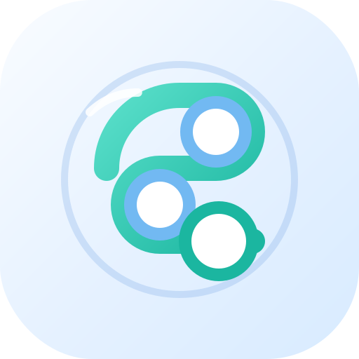

# Threadline

**Deutsch** | [English](README.md)

<p align="center">
  
</p>

<p align="center">
  Eine Progressive Web App zum Schreiben, Aufteilen, Speichern und Veröffentlichen von Bluesky-Threads inklusive Bildern, Hashtags und lokaler Backup-Funktion.
</p>

## Live-App

- URL: [https://marsrakete.github.io/threadline/](https://marsrakete.github.io/threadline/)
- Repository: [https://github.com/marsrakete/threadline](https://github.com/marsrakete/threadline)

## Überblick

Threadline ist eine statische PWA für Bluesky-Threads. Die App verbindet sich mit einem Bluesky-App-Passwort, speichert Entwürfe lokal im Browser und hilft dabei, längere Texte in bearbeitbare Thread-Abschnitte aufzuteilen. Bilder, Hashtags, Segment-Änderungen und weitere Einstellungen bleiben lokal erhalten und können zusätzlich exportiert oder als kompletter Thread gespeichert werden.

## Funktionsumfang

- Bluesky-Anmeldung mit App-Passwort
- Lokale Session-Erneuerung ohne eigenes Backend
- Mehrsprachige Oberfläche: Deutsch, Englisch, Französisch
- Automatische Sprachwahl anhand der Browser-Sprache mit Fallback auf Englisch
- Manuelle Sprachwahl in den Einstellungen, inklusive `Automatisch`
- Installierbare PWA mit Service Worker, Offline-App-Hülle und Install-Button
- Hilfe-Dialog direkt aus dem README in der App
- Update-Erkennung über `version.json` mit manueller Prüfung in den Einstellungen
- Statusanzeige und Historie der letzten Postings

## Schreiben Und Aufteilen

- Ein großes Composer-Feld für den Ausgangstext
- Automatisches Aufteilen in Thread-Abschnitte ab mehr als 300 Zeichen
- Umbruch möglichst an Wortgrenzen
- Vorhandene Zeilenumbrüche werden berücksichtigt
- Optionaler Zähler `1/x`, immer in einer eigenen Schlusszeile pro Abschnitt
- Optionales Thread-Emoji `⤵️` für alle Abschnitte außer dem letzten, vor einem aktiven Zähler
- Manueller harter Abschnittswechsel mit `%%`
- Die Thread-Abschnitte dürfen nachträglich bearbeitet werden
- Sobald ein Abschnitt manuell verändert wurde, wird der Composer gesperrt, damit die Bearbeitung nicht versehentlich überschrieben wird
- Mit `Änderung ignorieren` wird nur der Composer wieder freigegeben; die vorhandene Thread-Anzeige bleibt dabei unverändert

## Hashtag-Verwalter

- Hashtags können mit oder ohne `#` eingegeben werden
- Groß- und Kleinschreibung bleibt erhalten, zum Beispiel `#mdRzA`
- Darstellung als klickbare Word-Cloud
- Einzelne Hashtags können ausgewählt, bearbeitet oder gelöscht werden
- Bearbeiten erfolgt über ein UI-Popup
- Ausgewählte Hashtags werden automatisch gesammelt im ersten oder letzten Thread-Abschnitt eingefügt
- Beim Posten werden Hashtags als Bluesky-Rich-Text-Facets übertragen, damit sie anklickbar sind

## Bilder Pro Thread-Abschnitt

- Pro Abschnitt können bis zu 4 Bilder angehängt werden
- Bilder werden unter dem jeweiligen Abschnitt als kleine Vorschau angezeigt
- Jedes Bild bleibt seinem Thread-Abschnitt fest zugeordnet
- Bilder können innerhalb eines Abschnitts nach links oder rechts sortiert werden
- Ein Mülleimer entfernt einzelne Bilder
- Ein ALT-Text-Editor öffnet sich als UI-Popup
- Ein Bild-Editor erlaubt:
- Ausschnitt verschieben
- Zoomen
- horizontal spiegeln
- vertikal spiegeln
- um 90° nach links drehen
- Wenn ein Bild für Bluesky zu groß ist, wird es markiert und das Posting blockiert
- Im Editor gibt es dann den Hinweis `Reinzoomen und Ausschnitt festlegen` sowie `Verkleinern (Verlustbehaftet)`
- Angezeigt werden sowohl die Originalgröße als auch die Exportgröße für Bluesky

## Inklusion Und ALT-Texte

- ALT-Texte können pro Bild gepflegt werden
- Optional lässt sich in den Einstellungen `ALT-Text Pflicht: Ich möchte inklusive Postings erstellen` aktivieren
- Diese Option ist standardmäßig eingeschaltet
- Wenn aktiviert, darf nur gepostet werden, wenn alle Bilder einen ALT-Text haben
- Fehlende ALT-Texte werden sichtbar markiert
- Oberhalb des Post-Buttons erscheint ein Warnhinweis

## Speichern, Laden Und Backup

### Automatische Lokale Speicherung

- Ausgangstext bleibt über Reloads und Neustarts erhalten
- Thread-Abschnitte bleiben erhalten, auch wenn sie manuell bearbeitet wurden
- Bilder, ALT-Texte, Hashtags, Sprache, Historie und weitere Einstellungen bleiben lokal gespeichert
- Die Daten liegen in `IndexedDB`, nicht im `localStorage`

### Thread Speichern Und Laden

- Ein kompletter Thread kann als Datei gespeichert werden
- Gespeichert werden dabei:
- Ausgangstext
- aktuelle Thread-Abschnitte
- Bilder pro Abschnitt
- ALT-Texte
- Bildbearbeitungen
- Hashtags und Platzierung
- Ein gespeicherter Thread kann später wieder geladen werden
- Beim Laden wird ein bestehender Thread nach Sicherheitsabfrage überschrieben
- Der Import baut die gespeicherten Thread-Abschnitte wieder so auf, wie sie gespeichert wurden, unabhängig davon, wie der Ausgangstext heute neu gesplittet würde

### Einstellungen-Backup

- In den Einstellungen kann ein Backup gespeichert und importiert werden
- Das Backup enthält unter anderem:
- Spracheinstellung
- Sichtbarkeit der Tipps
- Einstellung zur ALT-Text-Pflicht
- Hashtags
- ausgewählte Hashtags
- Hashtag-Platzierung
- Posting-Historie
- Beim Import von Hashtags wird gemerged
- Vorhandene Hashtags bleiben erhalten
- Neue Hashtags werden ergänzt
- Dubletten werden nicht doppelt importiert
- Wichtig: Das Backup enthält ausdrücklich **kein** Bluesky-Konto und **kein** Passwort

## Posting Auf Bluesky

- Ein einzelner kurzer Text kann als normaler Post gesendet werden
- Längere Texte werden als Thread veröffentlicht
- Bilder werden gemeinsam mit den jeweiligen Segmenten hochgeladen
- Nach erfolgreichem Post erscheint ein Dialog mit Link zum erstellten Posting
- Fortschritt und Fehler werden in UI-Popups angezeigt
- Hashtags, Mentions und Links werden beim Posten als Rich-Text-Facets übertragen, damit sie in Bluesky anklickbar sind

## Warum Es Keine Link-Cards Gibt

### Kurz Erklärt

Threadline läuft komplett als statische App im Browser und hat kein eigenes Backend. Darum kann die App fremde Webseiten nicht zuverlässig auslesen, um daraus Vorschaukarten mit Titel, Beschreibung und Bild zu bauen. Links im Text funktionieren trotzdem und bleiben in Bluesky anklickbar, aber eine automatisch erzeugte Link-Card wird von Threadline derzeit nicht erstellt.

### Für Techies

Das Problem ist Cross-Origin-Zugriff im Browser. Um Open-Graph-Daten einer fremden Seite zu lesen, müsste die Zielseite den Abruf per CORS ausdrücklich erlauben. Viele Websites tun das nicht. Ohne eigenen Server oder Worker kann eine PWA auf GitHub Pages diese HTML-Antworten und Vorschaubilder daher nicht verlässlich auslesen und als `app.bsky.embed.external` mit Thumbnail aufbereiten. Deshalb beschränkt sich Threadline aktuell bewusst auf klickbare Links per Rich-Text-Facets.

## Letzte Postings

- Unterhalb des Statusbereichs gibt es einen Bereich `Letzte Postings`
- Ein Klick öffnet eine Liste mit:
- Zeitstempel
- Bluesky-URL
- Anzahl der Thread-Posts
- Anzahl der verwendeten Bilder
- Einzelne Einträge lassen sich löschen
- Die komplette Historie kann in den Einstellungen geleert werden
- Die Historie ist auch im Backup enthalten

## Tipps

- Unter dem Composer wird ein zufälliger Tipp angezeigt
- Es gibt einen Button für den nächsten Tipp
- Tipps können ausgeblendet werden
- In den Einstellungen lassen sie sich später wieder einschalten

## Bluesky-App-Passwort Erzeugen

Threadline verwendet ein Bluesky-App-Passwort und nicht dein normales Konto-Passwort.

1. Öffne Bluesky.
2. Gehe zu `Einstellungen`.
3. Öffne `Datenschutz und Sicherheit`.
4. Öffne `App-Passwörter`.
5. Erzeuge ein neues App-Passwort.
6. Kopiere das erzeugte Passwort und verwende es in Threadline.

Ein eigenes App-Passwort ist sinnvoll, weil du es später wieder entziehen kannst, ohne dein normales Login-Passwort ändern zu müssen.

## Lokal Starten

Threadline ist eine statische App. Ein einfacher lokaler Webserver reicht aus.

```powershell
python -m http.server 4173
```

Danach im Browser öffnen:

```text
http://localhost:4173
```

## Als App Installieren

Threadline ist eine PWA und kann auf Handy und Desktop installiert werden.

### Auf Dem Handy

#### iPhone / iPad (Safari)

1. Öffne [https://marsrakete.github.io/threadline/](https://marsrakete.github.io/threadline/) in Safari.
2. Tippe auf den Teilen-Button.
3. Wähle `Zum Home-Bildschirm`.
4. Bestätige mit `Hinzufügen`.

Hinweis: Unter iOS kann die Installation nicht automatisch ausgelöst werden. In der App gibt es dafür einen Install-Button mit Anleitung.

#### Android (Chrome oder Edge)

1. Öffne [https://marsrakete.github.io/threadline/](https://marsrakete.github.io/threadline/) im Browser.
2. Nutze den Install-Button in der App oder das Browser-Menü.
3. Tippe auf `App installieren` oder `Zum Startbildschirm hinzufügen`.
4. Bestätige die Installation.

### Auf Dem Desktop

#### Chrome oder Edge

1. Öffne [https://marsrakete.github.io/threadline/](https://marsrakete.github.io/threadline/).
2. Nutze den Install-Button in der App oder das Installationssymbol in der Browser-Leiste.
3. Bestätige den Installationsdialog.

#### Das Bringt Die Installation

- ein eigenständiges App-Fenster
- eine Verknüpfung auf Startbildschirm oder Desktop
- schnelleres Wiederöffnen wie bei einer normalen App
- offline-fähige App-Hülle durch den Service Worker

## Hinweise Zu Zugangsdaten Und Speicherung

- Das Bluesky-App-Passwort wird lokal gespeichert, damit die Session erneuert werden kann
- Session-Daten, Entwurf und App-Zustand liegen lokal in IndexedDB
- Für diese App ist kein eigenes Backend nötig

## Projektstruktur

```text
.
├── app.js
├── index.html
├── manifest.webmanifest
├── styles.css
├── sw.js
├── translations.js
├── version.json
└── icons/
    ├── icon.svg
    └── maskable-icon.svg
```

## Update-Erkennung

Threadline verwendet eine Versionsprüfung mit sichtbarer App-Version.

- `version.json` enthält die öffentlich sichtbaren Versionsinformationen
- der Service Worker lädt `version.json` mit Netz-Priorität
- die App prüft beim Start auf Updates
- in den Einstellungen kann man manuell auf Updates prüfen

Bei Änderungen sollten diese Dateien konsistent gehalten werden:

- `version.json`
- `app.js` (`CURRENT_VERSION_INFO`)
- `sw.js` (`APP_VERSION`) wenn sich gecachte Assets oder das Verhalten des Service Workers ändern

## Empfohlene Tests

- Verwende ein eigenes Bluesky-Testkonto, oder
- erstelle ein separates App-Passwort zum Testen

Damit kannst du sinnvoll prüfen:

- Login-Ablauf
- automatische Session-Erneuerung
- Entwurfs-Speicherung
- Split-Verhalten
- manuelle Segment-Bearbeitung
- Thread-Datei speichern und laden
- Backup exportieren und importieren
- Bilder und ALT-Texte
- Thread-Veröffentlichung
- Update-Erkennung

## Lizenz

- Lizenz: [Apache License 2.0](https://marsrakete.github.io/threadline/LICENSE)

## Kontakt

- Kontakt: [millux@marsrakete.de](mailto:millux@marsrakete.de)
