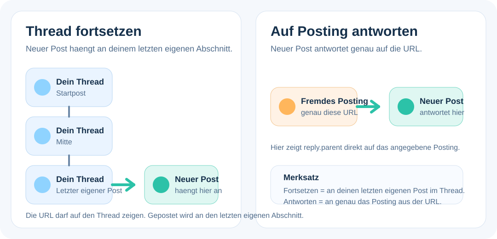

# Threadline

**Deutsch** | [English](README.md)

<p align="center">
  
</p>

<p align="center">
  Eine Progressive Web App zum Schreiben, Aufteilen, Speichern und Veröffentlichen von Bluesky-Threads inklusive Bildern, Hashtags und lokaler Backup-Funktion.
</p>

[](https://ko-fi.com/U7U01OC260)

## Live-App

- URL: [https://marsrakete.github.io/threadline/](https://marsrakete.github.io/threadline/)
- Repository: [https://github.com/marsrakete/threadline](https://github.com/marsrakete/threadline)

## Überblick

Threadline ist eine statische PWA für Bluesky-Threads. Die App verbindet sich mit einem Bluesky-App-Passwort, speichert Entwürfe lokal im Browser und hilft dabei, längere Texte in bearbeitbare Thread-Abschnitte aufzuteilen. Bilder, Hashtags, Segment-Änderungen und weitere Einstellungen bleiben lokal erhalten und können zusätzlich exportiert oder als kompletter Thread gespeichert werden.

## Kurz

Threadline ist inzwischen deutlich mehr als ein Thread-Composer. Mit eigenen Workspaces für Archiv-Funktion, Analyse, Netzwerk und DM-Archiv, direkter In-App-Hilfe, robusterem Export, besserer mobiler HTML-Lesbarkeit und Drag-and-Drop für Bilder wird die App zu einer kleinen Bluesky-Arbeitsumgebung.

## In 3 Schritten Zum Ersten Thread-Post

1. Erzeuge ein Bluesky-App-Passwort, füge dein Konto in Threadline hinzu und melde dich an.
2. Schreibe oder füge deinen Text in den Composer ein, ergänze bei Bedarf Bilder, ALT-Texte und Hashtags.
3. Prüfe die Thread-Abschnitte und veröffentliche den Thread mit dem Post-Button.

## Bluesky-App-Passwort Erzeugen

Threadline verwendet ein Bluesky-App-Passwort und nicht dein normales Konto-Passwort.

1. Öffne Bluesky.
2. Gehe zu `Einstellungen`.
3. Öffne `Datenschutz und Sicherheit`.
4. Öffne `App-Passwörter`.
5. Erzeuge ein neues App-Passwort.
6. Kopiere das erzeugte Passwort und verwende es in Threadline.

Ein eigenes App-Passwort ist sinnvoll, weil du es später wieder entziehen kannst, ohne dein normales Login-Passwort ändern zu müssen.

## Funktionsumfang

- Bluesky-Anmeldung mit App-Passwort über einen kompakten `Konto hinzufügen`-Dialog
- Presets für `bsky.social`, `eurosky.social`, Mu.social mit automatischer PDS-Erkennung und eigene PDS-Server
- Mehrere gespeicherte Logins mit schnellem Kontowechsel
- Konten bleiben nach dem Abmelden sichtbar und können per Icon wieder angemeldet oder entfernt werden
- Lokale Session-Erneuerung ohne eigenes Backend
- Mehrsprachige Oberfläche: Deutsch, Englisch, Französisch
- Automatische Sprachwahl anhand der Browser-Sprache mit Fallback auf Englisch
- Manuelle Sprachwahl in den Einstellungen, inklusive `Automatisch`
- Installierbare PWA mit Service Worker, Offline-App-Hülle und Install-Button
- Auf mobilen Geräten lässt sich die linke Spalte über einen Aufklapper ein- und ausblenden
- Hilfe-Dialog direkt aus dem README in der App
- Die App erkennt neue Versionen, kann manuell danach suchen und zeigt bei Bedarf direkt einen Neu-laden-Button
- Statusanzeige und Historie der letzten Postings
- Bestehende Threads lassen sich fortsetzen oder per Posting-URL gezielt beantworten
- Optionaler WordPress-Link-Card-Proxy, um aus URLs in einzelnen Thread-Abschnitten Bluesky-Link-Cards zu erzeugen
- Eigener Workspace `Analyse`, um zwei Accounts stilometrisch und zeitlich miteinander zu vergleichen

## Schreiben Und Aufteilen

- Ein großes Composer-Feld für den Ausgangstext
- Automatisches Aufteilen in Thread-Abschnitte ab mehr als 300 Zeichen
- Umbruch möglichst an Wortgrenzen
- Vorhandene Zeilenumbrüche werden berücksichtigt
- `Post-Einstellungen` als eigenes UI-Popup für Marker, Sprachen und Interaktionsregeln
- Bis zu 3 Post-Sprachen auswählbar; Standard ist die aktuelle App-Sprache
- Optionaler Zähler `1/x`, immer in einer eigenen Schlusszeile pro Abschnitt
- Optionaler Hinweis `Ein Thread 🧵` am Ende des ersten Abschnitts
- Optionales Thread-Emoji `⤵️` für alle Abschnitte außer dem letzten, vor einem aktiven Zähler
- Optional kann vor diesen Markern eine Leerzeile eingefügt werden
- Diese Marker erscheinen nur dann, wenn wirklich mehr als ein Thread-Abschnitt entsteht
- Manueller harter Abschnittswechsel mit `%%`
- Die Thread-Abschnitte dürfen nachträglich bearbeitet werden
- Sobald ein Abschnitt manuell verändert wurde, wird der Composer gesperrt, damit die Bearbeitung nicht versehentlich überschrieben wird
- Mit `Änderung ignorieren` wird nur der Composer wieder freigegeben; die vorhandene Thread-Anzeige bleibt dabei unverändert

## Antworten Und Thread Fortsetzen



- Über den Button neben `Post-Einstellungen` kann eine Posting-URL geprüft und als Antwortsziel gesetzt werden
- Im Composer erscheint dann eine Ziel-Kachel mit Avatar, Name und Textausschnitt des Ziel-Postings oder Threads
- `Auf Posting antworten` bedeutet: Threadline antwortet genau auf das angegebene Posting
- `Thread fortsetzen` bedeutet: Threadline hängt den neuen Abschnitt an den letzten eigenen Post innerhalb dieses Threads an
- Für `Thread fortsetzen` reicht ein Eintrag aus `Letzte Postings`; Threadline ermittelt daraus den letzten eigenen Post im Thread
- Bei einer Thread-Fortsetzung zeigt die Kachel zur Orientierung den Thread-Einstieg, gepostet wird aber als Antwort auf den letzten eigenen Post
- Bei einer Thread-Fortsetzung kann eine bestehende Nummerierung wie `1/x` nicht mehr konsistent bleiben, weil frühere Posts nicht nachträglich angepasst werden können
- Das gewählte Ziel bleibt reload-sicher als Teil des lokalen Entwurfs erhalten
- Vor dem Posten erscheint zusätzlich eine Sicherheitsabfrage, die klar benennt, ob geantwortet oder ein Thread fortgesetzt wird

## Post-Interaktionen

- In `Post-Einstellungen` lässt sich festlegen, wer antworten darf
- Unterstützt werden `Jeder`, `Niemand` oder eine Auswahl aus `Follower`, `Personen, denen du folgst` und `Personen, die du erwähnst`
- Zusätzlich kann gesteuert werden, ob Zitate des Posts erlaubt sind
- Diese Einstellungen werden reload-sicher gespeichert und beim Posten an Bluesky übergeben

## Hashtag-Verwalter

- Hashtags können mit oder ohne `#` eingegeben werden
- Groß- und Kleinschreibung bleibt erhalten, zum Beispiel `#mdRzA`
- Darstellung als klickbare Word-Cloud
- Einzelne Hashtags können ausgewählt, bearbeitet oder gelöscht werden
- Bearbeiten erfolgt über ein UI-Popup
- Ausgewählte Hashtags werden automatisch gesammelt im ersten, letzten oder in jedem Thread-Abschnitt eingefügt
- Für `in jedem Abschnitt` gibt es Varianten oben und unten
- Beim Posten werden Hashtags als Bluesky-Rich-Text-Facets übertragen, damit sie anklickbar sind

## Bilder Pro Thread-Abschnitt

- Pro Abschnitt können bis zu 10 Bilder angehängt werden
- Bilder werden unter dem jeweiligen Abschnitt als kleine Vorschau angezeigt
- Jedes Bild bleibt seinem Thread-Abschnitt fest zugeordnet
- Bilder können innerhalb eines Abschnitts nach links oder rechts sortiert werden
- Ein Mülleimer entfernt einzelne Bilder
- Ein ALT-Text-Editor öffnet sich als UI-Popup
- Ein Bild-Editor erlaubt:
- Ausschnitt verschieben
- Zoomen
- horizontal spiegeln
- vertikal spiegeln
- um 90° nach links drehen
- Ein Klick auf die Bildvorschau öffnet ebenfalls den Bild-Editor
- Auf dem Desktop ist der Bild-Editor bewusst größer ausgelegt, und Zoomen funktioniert dort auch per Mausrad
- Wenn ein Bild für Bluesky zu groß ist, wird es markiert und das Posting blockiert
- Im Editor gibt es dann den Hinweis `Reinzoomen und Ausschnitt festlegen` sowie `Verkleinern (Verlustbehaftet)`
- Angezeigt werden sowohl die Originalgröße als auch die Exportgröße für Bluesky
- Die ALT-Text-Eingabe zeigt zusätzlich eine kleine Vorschau des später geposteten Ausschnitts
- Wenn der optionale WordPress-Proxy eingerichtet ist, kann eine erkannte URL in einem Abschnitt in eine Bluesky-Link-Card umgewandelt werden
- Link-Cards und Bilder schließen sich im selben Bluesky-Posting aus; Threadline warnt, bevor Bilder aus diesem Abschnitt entfernt werden

## Optionale Link-Cards Mit WordPress-Proxy

Threadline kann für URLs in einzelnen Thread-Abschnitten Bluesky-Link-Cards erzeugen. Die PWA selbst bleibt statisch, deshalb läuft das Abrufen der Metadaten über ein kleines optionales WordPress-Plugin.

- Plugin-Paket: `wordpress-plugin/threadline-link-card-proxy.zip`
- Plugin-Dokumentation: `wordpress-plugin/threadline-link-card-proxy/README.md`
- Voraussetzungen: Admin-Zugriff auf eine eigene WordPress-Installation, WordPress 6.0+, PHP 7.4+, eine erreichbare REST-API und ausgehende HTTP(S)-Requests vom Server
- Das Plugin zeigt Proxy-Endpunkt und Secret im WordPress-Admin unter `Threadline`
- In Threadline werden beide Werte unter `Einstellungen` -> `Link-Cards` eingetragen
- Link-Cards werden pro Abschnitt erzeugt; Bilder und Link-Cards schließen sich im selben Abschnitt aus

## Inklusion Und ALT-Texte

- ALT-Texte können pro Bild gepflegt werden
- Optional lässt sich in den Einstellungen `ALT-Text Pflicht: Ich möchte inklusive Postings erstellen` aktivieren
- Diese Option ist standardmäßig eingeschaltet
- Wenn aktiviert, darf nur gepostet werden, wenn alle Bilder einen ALT-Text haben
- Fehlende ALT-Texte werden sichtbar markiert
- Oberhalb des Post-Buttons erscheint ein Warnhinweis

## Speichern, Laden Und Backup

### Automatische Lokale Speicherung

- Ausgangstext bleibt über Reloads und Neustarts erhalten
- Thread-Abschnitte bleiben erhalten, auch wenn sie manuell bearbeitet wurden
- Bilder, ALT-Texte, Hashtags, Sprache, Historie und weitere Einstellungen bleiben lokal gespeichert
- Die Daten liegen in `IndexedDB`, nicht im `localStorage`

### Thread Speichern Und Laden

- Ein kompletter Thread kann als Datei gespeichert werden
- Wenn verfügbar, wird dafür ein komprimiertes `*.threadline.gz` verwendet; sonst normales JSON
- Gespeichert werden dabei:
- Ausgangstext
- aktuelle Thread-Abschnitte
- Bilder pro Abschnitt
- ALT-Texte
- Bildbearbeitungen
- Hashtags und Platzierung
- Ein gespeicherter Thread kann später wieder geladen werden
- Beim Laden wird ein bestehender Thread nach Sicherheitsabfrage überschrieben
- Der Import baut die gespeicherten Thread-Abschnitte wieder so auf, wie sie gespeichert wurden, unabhängig davon, wie der Ausgangstext heute neu gesplittet würde

### Einstellungen-Backup

- In den Einstellungen kann ein Backup gespeichert und importiert werden
- Das Backup enthält unter anderem:
- Spracheinstellung
- Sichtbarkeit der Tipps
- Einstellung zur ALT-Text-Pflicht
- gespeicherte Login-Einträge mit Handle, Server und Avatar
- Hashtags
- ausgewählte Hashtags
- Hashtag-Platzierung
- Posting-Historie
- Beim Import von Hashtags wird gemerged
- Vorhandene Hashtags bleiben erhalten
- Neue Hashtags werden ergänzt
- Dubletten werden nicht doppelt importiert
- Wichtig: Das Backup enthält gespeicherte Login-Einträge, aber ausdrücklich **keine** App-Passwörter
- Nach einem Import können diese Konten deshalb erneut nach dem App-Passwort fragen

### Account-Archiv

- Über den eigenen Bereich `Account-Archiv` können die eigenen Bluesky-Posts samt Bildern als Archiv gesichert werden
- Beim Laden kann zusätzlich der `Archivtyp` gewählt werden:
- `Voll-Archiv`: lädt alle eigenen Posts und alle eigenen Replies, auch in fremden Threads
- `Nur eigene Postings`: lädt eigene Top-Level-Posts und eigene Replies nur in eigenen Threads, aber keine eigenen Replies in fremden Threads
- `Eigene Threads komplett`: lädt eigene Posts, eigene Replies in diesen Threads und zusätzlich Antworten fremder Accounts innerhalb dieser eigenen Threads
- `Post-Änderung prüfen` untersucht eine Bluesky- oder Mu-Posting-URL auf Mu-kompatible Bearbeitungsmetadaten und vergleicht Originaltext und aktuellen Text
- Der Ablauf für normale Nutzung ist:
1. Zeitraum festlegen: alles, ein Jahr oder ein eigener Datumsbereich
2. Archivtyp festlegen: Voll-Archiv, Nur eigene Postings oder Eigene Threads komplett
3. Mit `Nächste Welle laden` die nächsten Posts und Bilder in die aktuelle Archiv-Sitzung holen
4. Bei Bedarf pausieren oder abbrechen und später an derselben Stelle fortsetzen
5. Mit `Archiv als ZIP sichern` ein technisches Backup aus Posts, Metadaten und Bildern speichern
6. Mit `HTML-Archiv erzeugen` eine offline-fähige Lesefassung mit Suche, Filtern und aufklappbaren Threads erzeugen
7. Mit `PDF-Bände erzeugen` daraus zusätzlich eine paginierte PDF-Fassung erzeugen
- Für große Accounts sollte der Export am besten auf einem Desktop-Gerät mit viel freiem Speicher in mehreren Wellen durchgeführt werden

## Posting Auf Bluesky

- Ein einzelner kurzer Text kann als normaler Post gesendet werden
- Längere Texte werden als Thread veröffentlicht
- Bilder werden gemeinsam mit den jeweiligen Segmenten hochgeladen
- Der Composer kann wahlweise einen neuen Post senden, auf ein bestehendes Posting antworten oder einen eigenen Thread fortsetzen
- Für Bilder berücksichtigt Threadline das aktuelle Bluesky-Limit von `2.000.000` Bytes und `4000 × 4000` Pixeln pro Bild
- Zu große Bilder werden im Composer markiert und müssen vor dem Posten im Bildeditor verkleinert werden
- Vor dem Posten gibt es eine Sicherheitsabfrage mit dem aktuell verwendeten Konto
- Nach erfolgreichem Post erscheint ein Dialog mit Link zum erstellten Posting
- Fortschritt und Fehler werden in UI-Popups angezeigt
- Hashtags, Mentions und Links werden beim Posten als Rich-Text-Facets übertragen, damit sie in Bluesky anklickbar sind
- Auch die gewählten Post-Sprachen und Interaktionseinstellungen werden an Bluesky übergeben

## Netzwerk-Workspace

- Der Bereich `Netzwerk` lädt Follower, Following und Mutuals schrittweise in Wellen und zeigt sie als interaktive Bühnenansicht
- Accounts können nach Beziehungstyp gefiltert, gesucht und direkt in einem Fokus-Overlay untersucht werden
- Der Fokus zeigt unter anderem Relevanz, Follow-Daten, Vorschau-Listen, gegenseitige Likes im Sample und aktuelle Aktivität
- `Relevant` hebt Accounts mit einem internen Score hervor, der aktuell vor allem Beziehungstyp, Follower-Zahl dieses Accounts und dessen Posting-Aktivität kombiniert
- Der Aktivitätsblock zeigt zurzeit den letzten Post sowie Posts und Likes auf diese aktuellen Posts in den letzten 14 und 60 Tagen

## Analyse-Workspace

- Der Bereich `Analyse` lädt zwei Accounts und vergleicht sie als zusätzlichen Indikator darauf, ob beide möglicherweise von derselben Person betrieben werden
- Die Analyse kombiniert sprachliche Merkmale wie Funktionswörter, Character n-grams, Jaccard-Ähnlichkeit, Cosine Similarity, Burrows's Delta und ein Kennzahlen-Profil
- Zusätzlich wird ein Zeitprofil aus Posting-Zeiten, Wochenrhythmus, Pausenverhalten und zeitlicher Nähe beider Accounts berechnet
- Zusätzlich vergleicht sie jetzt gemeinsame Follower, gemeinsames Following, gemeinsame Mutuals, die direkte A/B-Beziehung, Mention-Muster, verlinkte Domains, Hashtags, typische Reply-Ziele, Quote-Ziele, Sprach-Tags und den Medienanteil
- Gemeinsame Mutes und Blocks werden ebenfalls verglichen, wenn die betroffenen Vergleichsaccounts auch als gespeicherte Threadline-Konten vorliegen; sonst bleiben diese Werte nicht verfügbar
- Für jeden Account werden ein Überblick, typische Stunden, typische Wochentage, eine Wochen-Heatmap und eine 30-Tage-Ansicht mit Aktivitätspunkten gezeigt
- Im Vergleichsteil erscheinen Gesamtwertung, Einzelverfahren, Zeitvergleich sowie Stilmuster pro Kategorie nebeneinander
- Die Analyse ist nur ein Indiz. Sehr kurze Textbasis, Scheduling, stark wechselnde Themen oder absichtliche Stiländerungen können das Bild deutlich verzerren
- Die Ergebnisse lassen sich als PDF exportieren

## Letzte Postings

- Unterhalb des Statusbereichs gibt es einen Bereich `Letzte Postings`
- Ein Klick öffnet eine Liste mit:
- Zeitstempel
- Bluesky-URL
- verwendetes Konto
- Textvorschau des ersten Abschnitts
- Anzahl der Thread-Posts
- Anzahl der verwendeten Bilder
- Für passende Einträge gibt es dort einen Button `Thread fortsetzen`
- Einzelne Einträge lassen sich löschen
- Die komplette Historie kann in den Einstellungen geleert werden
- Die Historie ist auch im Backup enthalten

## Tipps

- Unter dem Composer wird ein zufälliger Tipp angezeigt
- Es gibt einen Button für den nächsten Tipp
- Tipps können ausgeblendet werden
- In den Einstellungen lassen sie sich später wieder einschalten

## Als App Installieren

Threadline ist eine PWA und kann auf Handy und Desktop installiert werden.

### Auf Dem Handy

#### iPhone / iPad (Safari)

1. Öffne [https://marsrakete.github.io/threadline/](https://marsrakete.github.io/threadline/) in Safari.
2. Tippe auf den Teilen-Button.
3. Wähle `Zum Home-Bildschirm`.
4. Bestätige mit `Hinzufügen`.

Hinweis: Unter iOS kann die Installation nicht automatisch ausgelöst werden. In der App gibt es dafür einen Install-Button mit Anleitung. Die linke Spalte kann auf mobilen Geräten platzsparend ein- und ausgeklappt werden.

#### Android (Chrome oder Edge)

1. Öffne [https://marsrakete.github.io/threadline/](https://marsrakete.github.io/threadline/) im Browser.
2. Nutze den Install-Button in der App oder das Browser-Menü.
3. Tippe auf `App installieren` oder `Zum Startbildschirm hinzufügen`.
4. Bestätige die Installation.

### Auf Dem Desktop

#### Chrome oder Edge

1. Öffne [https://marsrakete.github.io/threadline/](https://marsrakete.github.io/threadline/).
2. Nutze den Install-Button in der App oder das Installationssymbol in der Browser-Leiste.
3. Bestätige den Installationsdialog.

#### Das Bringt Die Installation

- ein eigenständiges App-Fenster
- eine Verknüpfung auf Startbildschirm oder Desktop
- schnelleres Wiederöffnen wie bei einer normalen App
- offline-fähige App-Hülle durch den Service Worker

## Technische Hinweise

Ausführlichere technische Informationen zu Archiv, Analyse-Verfahren, Netzwerk-Datenbasis, Link-Cards, lokalem Start, Update-Erkennung und empfohlenen Tests stehen in [TECHNICAL.de.md](TECHNICAL.de.md).

## OpenGraph-Bild

Die maßgebliche Quelle für das OpenGraph-Bild ist [icons/threadline-og-workspaces.svg](/C:/Projekte/threadline/icons/threadline-og-workspaces.svg).

Die abgeleiteten Rasterdateien erzeugst du mit:

```bash
npm run build:og-image
```

Render-Parameter und Ausgabeziele stehen in [og-image.config.json](/C:/Projekte/threadline/og-image.config.json).

## Lizenz

- Lizenz: [Apache License 2.0](https://marsrakete.github.io/threadline/LICENSE)

## Kontakt

- Kontakt: [millux@marsrakete.de](mailto:millux@marsrakete.de)
