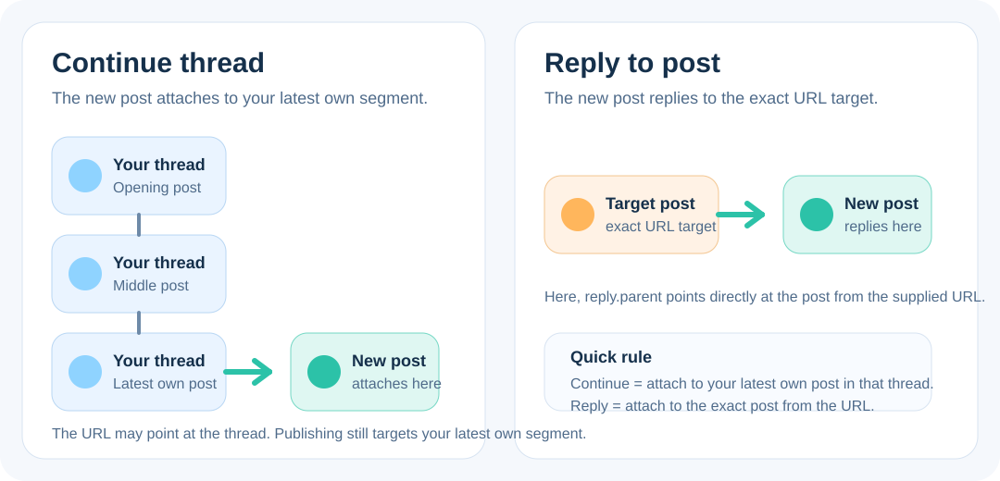

# Threadline

[Deutsch](README.de.md) | **English**

<p align="center">
  
</p>

<p align="center">
  A progressive web app for writing, splitting, saving, and publishing Bluesky threads with images, hashtags, and local backup support.
</p>

[](https://ko-fi.com/U7U01OC260)

## Live App

- URL: [https://marsrakete.github.io/threadline/](https://marsrakete.github.io/threadline/)
- Repository: [https://github.com/marsrakete/threadline](https://github.com/marsrakete/threadline)

## Overview

Threadline is a static PWA for publishing Bluesky threads. It connects with a Bluesky app password, stores drafts locally in the browser, and helps turn longer text into editable thread segments. Images, hashtags, segment edits, and other settings persist locally and can also be exported or saved as a complete thread file.

## In Short

Threadline has grown far beyond a thread composer. With dedicated workspaces for archive functions, analysis, network exploration, and DM archiving, direct in-app help, more robust exports, better mobile HTML readability, and drag-and-drop image handling, it now feels like a small Bluesky workbench.

## Project Guidelines

Development follows the local [PROJECT_GUIDELINES.md](PROJECT_GUIDELINES.md): keep structure, styling, behavior, and translations separated; prefer templates and DOM APIs over large HTML strings; keep user-facing text centralized; and treat broken encoding as a bug.

## First Thread Post In 3 Steps

1. Create a Bluesky app password, add your account in Threadline, and sign in.
2. Write or paste your text into the composer, then add images, ALT texts, and hashtags if needed.
3. Review the generated thread segments and publish your thread with the post button.

## Create A Bluesky App Password

Threadline uses a Bluesky app password, not your main account password.

1. Open Bluesky.
2. Go to `Settings`.
3. Open `Privacy and Security`.
4. Open `App Passwords`.
5. Create a new app password.
6. Copy the generated password and use it in Threadline.

Using a dedicated app password is recommended because you can revoke it later without changing your main login password.

## Feature Set

- Bluesky sign-in with app password through a compact `Add account` dialog
- Presets for `bsky.social`, `eurosky.social`, Mu.social with automatic PDS discovery, and custom PDS servers
- Multiple saved logins with quick account switching
- Accounts stay visible after sign-out and can be signed in again or removed via icon actions
- Local session renewal without a custom backend
- Multilingual UI: German, English, French
- Automatic browser-language detection with English fallback
- Manual language selection in settings, including `Automatic`
- Installable PWA with service worker, offline app shell, and install button
- On mobile devices, the left column can be collapsed and expanded with a compact toggle
- In-app help dialog based on the README
- The app detects new versions, lets you check manually, and shows a reload button when needed
- Status area and recent posting history
- Existing threads can be continued, or specific posts can be replied to by URL
- Optional WordPress link-card proxy for creating Bluesky link cards from URLs in individual thread segments
- Dedicated `Analysis` workspace for comparing two accounts stylistically and temporally

## Writing And Splitting

- Large composer field for the source text
- Automatic splitting into thread segments once the text exceeds 300 characters
- Splits try to break on word boundaries
- Existing line breaks are preserved as well as possible
- `Post settings` as a dedicated UI popup for markers, languages, and interaction rules
- Up to 3 post languages can be selected; the default is the current app language
- Optional `1/x` counters, always appended on their own line
- Optional `A thread 🧵` hint at the end of the first segment
- Optional thread emoji `⤵️` for every segment except the last one, inserted before an active counter
- Optionally a blank line can be inserted before those markers
- These markers only appear when the text actually becomes a multi-segment thread
- Manual hard split marker with `%%`
- Thread segments can be edited after splitting
- As soon as a segment is edited manually, the composer is locked to prevent accidental overwrites
- `Ignore change` only unlocks the composer; it does not rerender the existing thread preview

### Official Bluesky Limits

For the protocol details behind these limits, see [ATPROTO.md](ATPROTO.md).

In simple terms, Bluesky does not limit the total length of a whole thread. It limits each individual post inside the thread.

- Every thread segment becomes its own `app.bsky.feed.post`
- The important post limit is `300` Unicode grapheme clusters, meaning visible characters as Bluesky counts them
- That is why Threadline splits and warns per segment, not per whole thread
- Emojis, joined emoji sequences, and some other Unicode combinations can count differently than a simple JavaScript string length
- Chinese, Japanese, and similar scripts are not "special cases" in the protocol, but each visible character counts directly toward the same `300` limit

There is no officially documented total character limit for an entire thread in the AT Protocol or Bluesky docs. Technically, a thread is just a reply chain where every segment is linked through `reply.root` and `reply.parent`.

For extremely long threads, the practical limit is account write rate limits rather than a thread-length limit. Bluesky currently documents write budgets of `5,000` points per hour and `35,000` per day, and creating one normal new record costs `3` points.

### Grapheme Test Cases

Threadline now follows the official Bluesky limit of `300` Unicode grapheme clusters per post, not just JavaScript string length.

- `\"🙂\".repeat(300)` is exactly `300` grapheme clusters and should still fit into one post.
- `\"🙂\".repeat(301)` is `301` grapheme clusters and must be split or warned.
- `\"👨‍👩‍👧‍👦\".repeat(300)` is also exactly `300` grapheme clusters, even though each visible family emoji consists of multiple code points and many UTF-16 code units.
- `\"漢\".repeat(300)` is exactly `300` grapheme clusters; `\"漢\".repeat(301)` is too long. This is a good CJK test because each visible character counts directly toward the limit.

Quick browser-console check:

```js
const examples = {
  emoji300: "🙂".repeat(300),
  emoji301: "🙂".repeat(301),
  family300: "👨‍👩‍👧‍👦".repeat(300),
  han300: "漢".repeat(300),
  han301: "漢".repeat(301),
};

const segmenter = new Intl.Segmenter(undefined, { granularity: "grapheme" });

for (const [name, text] of Object.entries(examples)) {
  const graphemes = Array.from(segmenter.segment(text)).length;
  console.log(name, {
    graphemes,
    codePoints: Array.from(text).length,
    codeUnits: text.length,
  });
}
```

## Replies And Thread Continuation



- A button next to `Post settings` lets you check a post URL and set it as the reply target
- The composer then shows a target card with avatar, name, and a text preview of the target post or thread
- `Reply to post` means Threadline replies to exactly that specific post
- `Continue thread` means Threadline appends the new content to your latest own post inside that thread
- For `Continue thread`, you can start directly from an entry in `Recent posts`; Threadline resolves your latest own post in that thread
- In continuation mode the card shows the thread entry post for orientation, but publishing replies to your latest own post
- When continuing a thread, existing numbering such as `1/x` cannot remain fully consistent because earlier posts cannot be edited afterwards
- The selected target persists across reloads as part of the local draft
- Before publishing, an extra confirmation clearly states whether you are replying or continuing a thread

## Post Interactions

- `Post settings` can control who is allowed to reply
- Supported modes are `Everyone`, `Nobody`, or a selection of `Followers`, `People you follow`, and `People you mention`
- You can also control whether quotes of the post are allowed
- These settings persist across reloads and are sent to Bluesky during publishing

## Hashtag Manager

- Hashtags can be entered with or without `#`
- Original casing is preserved, for example `#mdRzA`
- Displayed as a clickable word cloud
- Individual hashtags can be selected, edited, or deleted
- Editing happens in a UI popup
- Selected hashtags are inserted together into the first segment, the last segment, or every segment
- For `every segment`, there are separate top and bottom placement modes
- Hashtags are posted as Bluesky rich-text facets so they become clickable

## Images Per Thread Segment

- Up to 10 images can be attached to each segment
- Images are shown below their segment as compact previews
- Each image stays assigned to its specific thread segment
- Images can be reordered left or right within a segment
- A trash button removes individual images
- ALT text can be edited in a dedicated popup
- An image editor supports:
- moving the crop
- zooming
- horizontal flip
- vertical flip
- rotating 90 degrees to the left
- Clicking the image preview also opens the image editor
- On desktop, the image editor is intentionally larger, and zooming also works with the mouse wheel
- If an image is too large for Bluesky, it is highlighted and posting is blocked
- The editor then offers the hint `Zoom in and define a crop` plus `Reduce size (lossy)`
- Both the original file size and the export size for Bluesky are shown
- The ALT-text dialog also shows a small preview of the actual crop that will be posted
- If the optional WordPress proxy is configured, a detected URL in a segment can be turned into a Bluesky link card
- Link cards and images are mutually exclusive in the same Bluesky post; Threadline warns before removing images from that segment

## Optional Link Cards With WordPress Proxy

Threadline can create Bluesky external link cards for URLs inside individual thread segments. The PWA itself stays static, so metadata fetching runs through a small optional WordPress plugin.

- Plugin package: `wordpress-plugin/threadline-link-card-proxy.zip`
- Plugin documentation: `wordpress-plugin/threadline-link-card-proxy/README.md`
- Rebuild the plugin ZIP after source changes with `npm run package:wordpress`
- Requirements: admin access to your own WordPress installation, WordPress 6.0+, PHP 7.4+, a reachable REST API, and outbound HTTP(S) requests from the server
- The plugin shows the proxy endpoint and secret in WordPress Admin under `Threadline`
- In Threadline, paste both values into `Settings` -> `Link cards`
- Link cards are created per segment; images and link cards are mutually exclusive in the same segment
- Standard.site pages are recognized as publication cards when their HTML exposes `site.standard.document` / `site.standard.publication` metadata; Threadline marks them as publications in Composer, Thread Explorer, and HTML archives
- Thread Explorer loads current posts in pages of 50, appends more while scrolling, and can use pinned Bluesky feed generators from the account preferences as additional entry points
- Loaded Thread Explorer trees can be downloaded as PNG snapshots; the filename includes the root post handle and date

## Inclusion And ALT Texts

- ALT text can be maintained per image
- In settings you can enable `ALT text required: I want to create inclusive posts`
- This option is enabled by default
- When enabled, posting is only allowed if every image has ALT text
- Missing ALT text is visibly marked
- A warning appears above the publish button

## Saving, Loading, And Backup

### Automatic Local Persistence

- Source text survives reloads and restarts
- Thread segments survive reloads, even when edited manually
- Images, ALT texts, hashtags, language, history, and other settings persist locally
- Data is stored in `IndexedDB`, not `localStorage`

### Save And Load Thread Files

- A complete thread can be saved as a file
- When supported, this uses a compressed `*.threadline.gz`; otherwise it falls back to plain JSON
- The saved thread includes:
- source text
- current thread segments
- images per segment
- ALT texts
- image edit state
- hashtags and placement
- A saved thread can later be loaded again
- Loading asks for confirmation before replacing the current thread
- Import restores the stored thread segments exactly as saved, regardless of how the current source text would split today

### Settings Backup

- Settings can be exported and imported from the settings dialog
- The backup includes, among other things:
- language preference
- tips visibility
- ALT-text requirement
- layout and composer preferences
- saved login entries with handle, server, and avatar
- local account avatar images
- hashtags
- selected hashtags
- hashtag placement
- locally saved Thread Explorer favorites
- posting history
- archive preferences
- analysis workspace state
- cached DM partner metadata and local contact avatar assets
- Hashtags are merged during import
- Existing hashtags stay
- New hashtags are added
- Duplicates are ignored
- Threadline reminds you to save a new settings backup when the last recorded backup is more than 30 days old
- The reminder popup contains a direct `Save backup` button
- Important: the backup includes saved login entries, but explicitly does **not** include app passwords, session tokens, full archive databases, full archive posts, complete DM exports, or current composer segment images
- After an import, those accounts may therefore ask for the app password again

### Account Archive

- The dedicated `Account archive` area can back up either your own Bluesky account or another reachable account together with its images
- For very large archives, Threadline is gradually moving toward a split model: interactive filtering in the browser, heavyweight long-running fetches in PowerShell
- Before loading, you can define the source account, date range, archive type, and whether full conversation context should be included
- In the PWA, the date range is intentionally limited to at most three months
- You can also choose an `Archive type` before loading:
- `Full archive`: loads all of your own posts and all of your own replies, including replies inside other people's threads
- `Own posts only`: loads your own top-level posts and your own replies only inside your own threads, but skips your replies in foreign threads
- `My threads complete`: loads your own posts, your own replies inside those threads, and replies from other accounts inside your own threads
- `Store full conversations`: additionally pulls in visible foreign reply context for matching replies and threads
- `Check post changes` inspects a Bluesky or Mu post URL for Mu-compatible edit metadata and compares the original and current text
- The normal user workflow is:
1. Choose the source account, a range of at most three months, and the archive type
2. Decide whether full conversation context should be included
3. Use `Load archive` to fetch posts and assets into the current archive session
4. Pause or cancel if needed and continue later from the same checkpoint
5. Use `Save archive as ZIP` to store a technical backup containing posts, metadata, and images
6. In the PWA, SVG images are not copied into the archive directly. They are replaced with a small dummy image for safety
7. Use `Generate HTML archive`, `Generate compact HTML`, or `Generate PDF volumes` to create readable outputs from that already loaded archive state
8. Use the single-thread tools below when you want to load one thread URL, check post edits, and export just that loaded thread
- For large accounts, the export should ideally be done on a desktop device with plenty of free storage
- If the embedded HTML archive becomes too large, Threadline recommends using the archive export together with the PowerShell script `scripts/convert-threadline-archive-to-html.ps1`
- A standalone PowerShell bulk archiver now lives in `scripts/archive-threadline.ps1`, and the newer SQLite-based variant lives in `scripts/archive-threadline-sqlite.ps1`
- Both PowerShell scripts also replace SVG files with a small dummy image by default; use `-AllowSvg` only when you explicitly want to disable that safeguard
- Their documentation and sample configs live in `scripts/README.threadline-archiver.md`, `scripts/threadline-archiver.config.sample.json`, and `scripts/threadline-archiver-sqlite.config.sample.json`
- The PowerShell archiver is designed to emit the **same archive JSON contract** as the browser app, so its ZIP output can still be loaded back into Threadline
- For large archives, the SQLite-based archiver plus its separate viewer script are usually the better route than pushing everything through the browser
- The script:
- accepts either a Threadline archive ZIP or an already unpacked archive folder
- generates a local HTML archive from it
- stages images, avatars, and link-card thumbnails into `archive-assets/` for the generated HTML
- preserves recognized Standard.site publication metadata and shows those link cards as publication cards in the generated HTML
- stays independent of browser limits for very large single-file HTML exports
- Example call:

```powershell
powershell -ExecutionPolicy Bypass -File .\scripts\convert-threadline-archive-to-html.ps1 `
  -ArchiveSourcePath "C:\Path\to\threadline-archive-....zip"
```

- Optional with a custom output directory:

```powershell
powershell -ExecutionPolicy Bypass -File .\scripts\convert-threadline-archive-to-html.ps1 `
  -ArchiveSourcePath "C:\Path\to\threadline-archive-....zip" `
  -OutputDirectory "C:\Path\to\my-html-archive" `
  -Force
```

- It can also work directly on an unpacked archive folder and write the HTML file there:

```powershell
powershell -ExecutionPolicy Bypass -File .\scripts\convert-threadline-archive-to-html.ps1 `
  -ArchiveSourcePath "C:\Path\to\threadline-archive-folder"
```

- Optional: `-InlineAssets` embeds avatars, images, and link-card thumbnails directly into the HTML as data URLs. The converter uses a conservative recommendation of about 150 MB of source assets unless you override it with `-Force`.
- By default, the converter reads posts directly from `threadline-archive.sqlite`. Use `-UsePostsJson` only when you explicitly want the legacy `posts.json` fallback.

- The result is a folder containing `manifest.json`, `threadline-archive.sqlite`, optional `posts.json`, all assets, and a generated HTML file

## Publishing To Bluesky

- Short text can be sent as a single post
- Longer text is published as a thread
- Images are uploaded together with their assigned segment
- The composer can either publish a new post, reply to an existing post, or continue one of your own threads
- Threadline now enforces the current Bluesky image limit of `2,000,000` bytes and `4000 x 4000` pixels per image
- Oversized images are highlighted in the composer and must be reduced in the image editor before publishing
- Before publishing, there is a safety confirmation showing the currently selected account
- After a successful publish, a dialog shows a link to the created post
- Progress and errors are shown in UI popups
- Hashtags, mentions, and links are posted as rich-text facets so they become clickable in Bluesky
- Selected post languages and interaction settings are also sent with the publish request

## Network Workspace

- The `Network` area loads followers, follows, and mutuals in waves and shows them in an interactive stage view
- Accounts can be filtered by relationship type, searched, and inspected directly in a focus overlay
- The focus currently shows relevance, follow dates, preview lists, mutual likes in the sample, and recent activity
- `Relevant` highlights accounts with an internal score that currently combines relationship type, that account's follower count, and that account's posting activity
- The activity block currently shows the latest post plus posts and likes on those recent posts in the last 14 and 60 days

## Analysis Workspace

- The `Analysis` area loads two accounts and compares them as an additional indicator of whether both may be operated by the same person
- The analysis combines language-focused signals such as function words, character n-grams, Jaccard similarity, cosine similarity, Burrows's Delta, and a metrics profile
- It also builds a temporal profile from posting times, weekly rhythm, pause behavior, and temporal proximity between both accounts
- It now also compares shared followers, shared follows, shared mutuals, direct A/B relationship, mention patterns, linked domains, hashtags, typical reply targets, quote targets, language tags, and media share
- Shared mutes and blocks are compared too when the corresponding compared accounts are available as saved Threadline accounts; otherwise those values stay unavailable
- For each account, the workspace shows an overview, typical hours, typical weekdays, a weekly heatmap, and a 30-day activity view with timeline dots
- The comparison section shows the overall score, individual methods, temporal comparison, and style-pattern cards side by side by category
- The analysis is only an indicator. Very small text bases, scheduling, topic shifts, or intentional style changes can skew the result substantially
- Results can be exported as PDF

## Recent Posts

- Below the status area there is a `Recent posts` section
- Clicking it opens a list with:
- timestamp
- Bluesky URL
- account used for publishing
- preview text from the first segment
- number of thread posts
- number of attached images
- Matching entries include a `Continue thread` action
- Individual history entries can be deleted
- The complete history can be cleared in settings
- History is also part of the backup

## Tips

- A random tip is shown below the composer
- There is a button for the next tip
- Tips can be hidden completely
- They can later be re-enabled in settings

## Install As An App

Threadline is a PWA and can be installed on mobile and desktop devices.

### On Mobile

#### iPhone / iPad (Safari)

1. Open [https://marsrakete.github.io/threadline/](https://marsrakete.github.io/threadline/) in Safari.
2. Tap the Share button.
3. Choose `Add to Home Screen`.
4. Confirm with `Add`.

Note: on iOS the installation cannot be triggered automatically. The app includes an install button that shows the required Safari steps. The left sidebar can also be collapsed on mobile to save space.

#### Android (Chrome or Edge)

1. Open [https://marsrakete.github.io/threadline/](https://marsrakete.github.io/threadline/) in the browser.
2. Use the install button in the app or the browser menu.
3. Tap `Install app` or `Add to Home screen`.
4. Confirm the installation.

### On Desktop

#### Chrome or Edge

1. Open [https://marsrakete.github.io/threadline/](https://marsrakete.github.io/threadline/).
2. Use the install button in the app or the install icon in the browser UI.
3. Confirm the install dialog.

#### What Installation Gives You

- a standalone app window
- a home screen or desktop shortcut
- faster reopening like a normal app
- an offline-ready app shell through the service worker

## Technical Notes

More detailed technical information about the archive, analysis methods, the network data model, link-card limits, running locally, update detection, and recommended testing is available in [TECHNICAL.md](TECHNICAL.md).

The protocol-specific endpoint, auth, DID/PDS, cursor, and limit notes are collected separately in [ATPROTO.md](ATPROTO.md).

## OpenGraph Image

The OpenGraph source of truth is [icons/threadline-og-workspaces.svg](/C:/Projekte/threadline/icons/threadline-og-workspaces.svg).

Build the derived raster files with:

```bash
npm run build:og-image
```

Rendering parameters and output targets are stored in [og-image.config.json](/C:/Projekte/threadline/og-image.config.json).

## License

- License: [Apache License 2.0](https://marsrakete.github.io/threadline/LICENSE)

## Contact

- Contact: [millux@marsrakete.de](mailto:millux@marsrakete.de)
