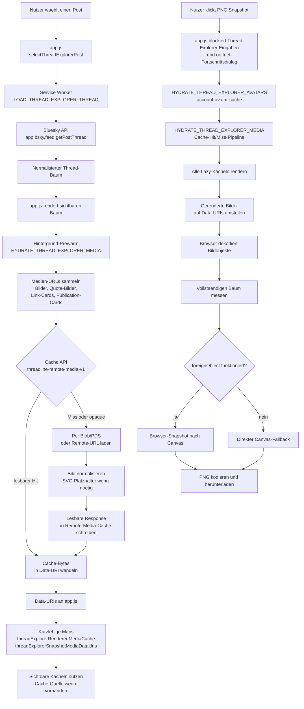

# Threadline Technische Hinweise

**Deutsch** | [English](TECHNICAL.md)

Diese Datei bündelt die technischeren Hintergrundinformationen, die nicht im schnellen Einstieg des Haupt-README stehen sollen.

## OpenGraph-Asset-Pipeline

Die maßgebliche Quelle für das OpenGraph-Bild ist `icons/threadline-og-workspaces.svg`. Die abgeleiteten Rasterdateien werden mit `npm run build:og-image` anhand der Einstellungen in `og-image.config.json` erzeugt.

Aktuelle Ausgaben:

- `icons/threadline-og-workspaces.png`
- `og-image.jpg`

## Schnittstellen-Überblick

Threadline ist eine statische PWA ohne eigenes Backend. Fast alle Datenflüsse laufen direkt vom Browser zum jeweils zuständigen Bluesky- oder AT-Protocol-Endpunkt. Der Service Worker in [sw.js](sw.js) bündelt dabei Login, API-Zugriffe, Caching und Archiv-Logik.

```mermaid
flowchart TD
    A["Benutzer im Browser"] --> B["app.js"]
    B --> C["Service Worker sw.js"]

    C --> D["Login<br/>com.atproto.server.createSession"]
    D --> E["Session mit DID, Handle,<br/>accessJwt, refreshJwt"]
    E --> F["PDS-Basis ableiten<br/>auth.pdsUrl oder auth.service"]
    F --> G["Refresh<br/>com.atproto.server.refreshSession"]

    C --> H["Composer"]
    H --> H1["Handle auflösen<br/>com.atproto.identity.resolveHandle"]
    H --> H2["Bilder hochladen<br/>com.atproto.repo.uploadBlob"]
    H --> H3["Post anlegen<br/>com.atproto.repo.createRecord"]
    H3 --> H4["optional Threadgate / Postgate"]

    C --> I["Archiv-Funktion"]
    I --> I1["Eigene Posts lesen<br/>com.atproto.repo.listRecords"]
    I --> I2["Threads erweitern<br/>app.bsky.feed.getPostThread"]
    I --> I3["Metriken nachladen<br/>app.bsky.feed.getPosts"]
    I --> I4["Bilder laden<br/>com.atproto.sync.getBlob"]

    C --> S["Suche"]
    S --> S1["Globale Suche<br/>app.bsky.feed.searchPosts"]
    S --> S2["Account-Posts / Reposts<br/>app.bsky.feed.getAuthorFeed"]
    S --> S3["URL-Auflösung / Favoriten<br/>lokale Thread-Explorer-Integration"]

    C --> J["Analyse"]
    J --> J1["Profile<br/>app.bsky.actor.getProfile"]
    J --> J2["Account-Feed<br/>app.bsky.feed.getAuthorFeed"]

    C --> L["Netzwerk"]
    L --> L1["Profil<br/>app.bsky.actor.getProfile"]
    L --> L2["Follower / Following<br/>app.bsky.graph.getFollowers / getFollows"]
    L --> L3["Aktuelle Posts<br/>app.bsky.feed.getAuthorFeed"]
    L --> L4["Likes auf aktuelle Posts<br/>app.bsky.notification.listNotifications"]

    C --> K["DM-Archiv"]
    K --> K1["Konversationen<br/>chat.bsky.convo.listConvos"]
    K --> K2["Nachrichten<br/>chat.bsky.convo.getMessages"]
    K --> K3["Anhänge / Bilder"]
```



## Thread-Explorer Cache- Und Snapshot-Pipeline

Der Thread Explorer ist zwischen der sichtbaren Browser-App in [app.js](app.js) und dem Service Worker in [sw.js](sw.js) aufgeteilt. Die App verwaltet Auswahlzustand, Baumdarstellung, Lazy-Hydration von Kacheln, Zoom/Pan-Zustand und den PNG-Exportdialog. Der Service Worker verwaltet authentifizierte Bluesky-Requests, Thread-Laden, Avatar-Hydration, Medien-Hydration und Cache-Zugriffe.

### Live-Thread Laden

Wenn ein Post ausgewählt wird, sendet `app.js` `LOAD_THREAD_EXPLORER_THREAD` an den Service Worker. Der Service Worker lädt den ausgewählten Post über `app.bsky.feed.getPostThread`, normalisiert den Thread-Baum und gibt Root-Knoten plus Post-Zähler zurück. Wenn der ausgewählte Post eine Antwort innerhalb eines anderen Threads ist, versucht Threadline vom erkannten Root aus neu zu laden und den ausgewählten Pfad wieder in den vollständigen Baum einzufügen.

Nach dem Rendern des Baums startet die App einen nicht blockierenden Medien-Prewarm. Dieser Prewarm ruft im Hintergrund `HYDRATE_THREAD_EXPLORER_MEDIA` auf. Er darf die normale Thread-Auswahl nicht verzögern: veraltete Prewarm-Läufe werden abgebrochen oder ignoriert, wenn der Nutzer einen anderen Post auswählt.

### Medien- Und Avatar-Caches

Threadline verwendet mehrere Caches mit unterschiedlichen Aufgaben:

- `account-avatar-cache` ist ein IndexedDB-gestützter App-Cache für Account-Avatare. Er speichert Bytes, MIME-Type, DID, Quell-URL und Zeitstempel.
- `threadline-remote-media-v1` ist der Cache-API-Speicher für Remote-Medien, die der Service Worker nutzt.
- `threadExplorerRenderedMediaCache` in `app.js` ist eine kurzlebige In-Memory-Map für den aktuell angezeigten Thread. Sie ordnet Medien-URLs canvas-sicheren Data-URIs zu.
- `threadExplorerSnapshotMediaDataUris` in `app.js` ist die Snapshot-spezifische Data-URI-Map, die während des PNG-Exports gefüllt wird.

Der Remote-Media-Cache kann zwei Arten von Einträgen enthalten:

- lesbare Responses, die Threadlines eigener Hydration-Pfad geschrieben hat
- opaque Browser-Bild-Responses, die durch normales Cross-Origin-Bildladen entstanden sind

Opaque Responses kann der Browser wiederverwenden, aber JavaScript kann ihre Bytes nicht auslesen. Für den PNG-Export lassen sich nur lesbare Responses in Data-URIs umwandeln und sicher in Canvas zeichnen.

### PNG-Snapshot-Stufen

Der PNG-Export blockiert bewusst die Eingaben im Thread Explorer. Der Export verändert den gerenderten DOM-Zustand, zwingt alle Kacheln zur Hydration, ersetzt Bilder durch Data-URIs, misst den gesamten Baum und zeichnet danach die Ausgabe. Würde der Nutzer währenddessen den Thread wechseln, Knoten einklappen oder zoomen, wäre die Snapshot-Geometrie ungültig.

Die wichtigsten Stufen sind:

1. `app.js` öffnet den Fortschrittsdialog und erzeugt einen Abort-Controller.
2. `HYDRATE_THREAD_EXPLORER_AVATARS` sammelt alle Autoren im Baum und stellt sicher, dass ihre Avatare im `account-avatar-cache` liegen.
3. `HYDRATE_THREAD_EXPLORER_MEDIA` sammelt Post-Bilder, Bilder zitierter Posts, Link-Card-Thumbnails und Publication-Card-Thumbnails.
4. Für jede Medien-URL prüft der Service Worker `threadline-remote-media-v1`.
5. Bei Cache-Hit werden lesbare Bytes direkt in eine Data-URI gewandelt.
6. Bei Cache-Miss lädt der Service Worker das Asset möglichst per Blob-Auflösung, normalisiert SVGs zu einem PNG-Platzhalter, schreibt die lesbare Response zurück in `threadline-remote-media-v1` und gibt eine Data-URI zurück.
7. `app.js` speichert die zurückgegebenen Data-URIs in den kurzlebigen Medien-Maps.
8. Die App zwingt alle Lazy-Kacheln des Thread Explorers einmal zum Rendern.
9. Gerenderte Bilder werden auf Data-URIs umgestellt und vom Browser-Bilddecoder geprüft.
10. Der vollständige Baum wird gemessen und wenn möglich über den Browser-`foreignObject`-Pfad exportiert.
11. Wenn `foreignObject` für diesen Baum nicht funktioniert, nutzt Threadline den direkten Canvas-Fallback-Renderer.

### Cache-Hit- Und Cache-Miss-Fortschritt

Während der Medien-Hydration meldet der Service Worker:

- `current` / `total`
- `remaining`
- `hydrated`
- `skipped`
- `cacheHits`
- `downloaded`

Damit kann die UI zwischen einem langsamen Netzlauf und einem weitgehend gecachten Export unterscheiden. Ein wiederholter Export desselben Threads sollte viele Cache-Hits und weniger neu geladene Assets zeigen. Wenn `downloaded` nach einem vorherigen vollständigen Export weiterhin hoch bleibt, sind typische Ursachen abgelaufener Browser-Speicher, Cache-Eviction, nur opaque vorhandene Bild-Einträge, geänderte CDN-URLs oder Medien-URLs, die nicht normalisiert werden konnten.

### Ablauf



## PowerShell-Archiver

Für große Account-Archive hat Threadline jetzt eine klare Zwei-Teil-Richtung:

- die Browser-PWA bleibt die interaktive Oberfläche
- ein eigenständiger PowerShell-Archiver übernimmt lange Bulk-Abrufe

Die zentrale technische Bedingung ist die Kompatibilität:

**Der PowerShell-Archiver muss denselben Archiv-JSON-Vertrag erzeugen, den die Browser-App heute bereits exportiert.**

Das bedeutet:

- dieselbe Struktur für `manifest.json` und `posts.json`
- dieselben Asset-Ordnerkonventionen
- ZIP-Ausgaben, die sich weiterhin direkt wieder in Threadline importieren lassen
- Kompatibilität mit `scripts/convert-threadline-archive-to-html.ps1`

Script und Dokumentation für dieses Tool liegen hier:

- `scripts/archive-threadline.ps1`
- `scripts/README.threadline-archiver.de.md`

## Suche-Workspace Interna

Der Suche-Workspace kombiniert bewusst zwei Strategien:

- direkte serverseitige Suche über `app.bsky.feed.searchPosts`
- lokale Feed-Durchläufe über `app.bsky.feed.getAuthorFeed`

Diese Aufteilung ist nötig, weil die eingebaute Bluesky-Suche gut für globale Funde ist, aber nicht alle Suchmodi und Filter von Threadline allein abbilden kann.

### Suchmodi

- `Netzwerk-Suche`
  - nutzt `app.bsky.feed.searchPosts`
  - geeignet für globale Themensuche, account-begrenzte globale Suche, Hashtag-Suche und URL-/Domain-Filter
- `Posts eines Accounts`
  - läuft über `app.bsky.feed.getAuthorFeed`
  - erlaubt Threadline, einen Account-Feed lokal zu prüfen, auch wenn der globale Suchindex unvollständig ist
- `Reposts eines Accounts`
  - läuft ebenfalls über `app.bsky.feed.getAuthorFeed`
  - behält nur Feed-Einträge mit `reasonRepost`
- `Hashtag-Suche`
  - startet mit `app.bsky.feed.searchPosts`
  - kann zwischen dokumentierter UND-Verknüpfung und Threadlines eigenem Modus `Mindestens ein Hashtag` umschalten

### Warum lokale Filter nötig sind

Die Bluesky-API bietet nicht jeden UI-Filter als direkten serverseitigen Parameter an. Threadline führt deshalb in `sw.js` nach dem Laden noch einen zweiten Filterdurchlauf aus.

Typische lokale Zusatzfilter sind:

- Ausschlussbegriffe
- Post-Typ wie Original-Posts, Replies, Quotes, Reposts oder alles außer Reposts
- Posts ohne Medien
- Erwähnungs-Prüfung
- Mehrsprachen-Zusammenführung
- reine Feed-Durchläufe für einzelne Accounts
- `Mindestens ein Hashtag` über mehrere API-Varianten

### Mehrsprachen- und Hashtag-Varianten

Wenn mehr als eine Sprache gewählt ist, führt Threadline mehrere `searchPosts`-Anfragen aus und führt die Ergebnisse lokal zusammen. Dasselbe passiert beim Modus `Mindestens ein Hashtag`:

- Bluesky dokumentiert mehrere `tag`-Parameter als UND-Verknüpfung
- Threadline bildet ODER-Verhalten nach, indem pro Hashtag eine eigene Suchvariante geladen und anschließend nach Post-URI dedupliziert wird

Darum verwaltet der Suche-Workspace zusätzlich zum normalen API-Cursor noch einen eigenen Cursor-Zustand für Varianten.

## Login Und Auth

### Was beim Login passiert

1. Die App prüft den angegebenen Service und beschreibt ihn über `com.atproto.server.describeServer`.
2. Danach wird über `com.atproto.server.createSession` eine Session mit DID, Handle, `accessJwt` und `refreshJwt` erzeugt.
3. Threadline speichert diese Session lokal, damit Reloads und längere Archivläufe funktionieren.
4. Für weitere Requests wird möglichst die PDS-Basis des eingeloggten Accounts verwendet, also `auth.pdsUrl` oder `auth.service`, nicht blind `bsky.social`.

Zur Einordnung sind vor allem diese Originalquellen hilfreich:

- [Protocol Overview](https://atproto.com/guides/overview)
- [AT Protocol Specification](https://atproto.com/specs/atp)

### Wozu `refreshSession` dient

- `com.atproto.server.refreshSession` wird genutzt, wenn ein Access-Token während eines längeren Vorgangs abläuft.
- Das ist vor allem für Archiv-Funktion, Netzwerk und DM-Archiv wichtig, weil dort viele Requests hintereinander laufen können.

### Sicherheitsrelevante Hinweise

- Threadline blockiert bewusst unsichere `http://`-PDS-Server.
- App-Passwörter und Sessions liegen lokal im Browser, weil die App ohne eigenes Backend arbeitet.
- Das ist praktisch für eine PWA, aber sicherheitlich sensibel und im [TODO.md](TODO.md) bewusst als offener Punkt notiert.

## Repo-Befehle

Diese Befehle arbeiten direkt auf Records im AT-Protocol-Repo eines Accounts.

`Repo` meint hier nicht ein Git-Repository, sondern das persönliche Daten-Repository eines Accounts im AT-Protokoll. Darin liegen zum Beispiel Posts, Follows, Likes oder weitere accountbezogene Records.

Mehr Hintergrund dazu:

- [Reads and Writes](https://atproto.com/guides/reads-and-writes)
- [Reading Data](https://atproto.com/guides/reading-data)

### `com.atproto.repo.listRecords`

Wird vor allem in der Archiv-Funktion verwendet.

- Liest seitenweise eigene Repo-Einträge.
- Threadline nutzt das für `app.bsky.feed.post`, also die eigenen Posts.
- Darauf bauen Datumsfilter, Hashtag-Filter und die verschiedenen Archiv-Typen auf.

### `com.atproto.repo.getRecord`

Wird punktuell verwendet, wenn ein einzelner Record mit URI gezielt nachgeladen werden muss.

- Im Netzwerk unter anderem für Beziehungsdaten wie Follow-Zeitpunkte.
- Hilfreich, wenn eine Beziehung nicht nur als Status, sondern auch mit Datum angezeigt werden soll.

### `com.atproto.repo.createRecord`

Wird beim Veröffentlichen aus dem Composer genutzt.

- legt eigentliche Posts vom Typ `app.bsky.feed.post` an
- legt bei Bedarf `app.bsky.feed.threadgate` an
- legt bei Bedarf `app.bsky.feed.postgate` an

Damit steuert Threadline nicht nur den Post-Inhalt selbst, sondern auch Antworten und Zitierbarkeit.

### `com.atproto.repo.uploadBlob`

Wird für Composer-Bilder verwendet.

- Bilddateien werden erst als Blob auf die zuständige PDS hochgeladen.
- Der spätere Post referenziert diese Blob-Handles.
- ALT-Texte werden dabei zusammen mit den Bild-Referenzen in das Embed geschrieben.

## Get-Befehle

### `app.bsky.actor.getProfile`

Lädt Profilbasisdaten eines Accounts.

Wird genutzt für:

- Avatare
- Anzeigenamen
- Handles
- Follower-/Following-Zahlen
- Fokus-Ansicht im Netzwerk
- Profilbasis im Analyse-Workspace für die beiden Vergleichsaccounts

### `app.bsky.graph.getFollowers`

Lädt die Accounts, die einem Zielaccount folgen.

Wird genutzt für:

- Netzwerk-Wellen
- Mutual-Berechnung
- gemeinsame Mutuals

### `app.bsky.graph.getFollows`

Lädt die Accounts, denen ein Zielaccount folgt.

Wird genutzt für:

- Netzwerk-Wellen
- Mutual-Berechnung
- Netzwerk eines fokussierten Accounts

### `app.bsky.feed.getAuthorFeed`

Lädt aktuelle Posts eines Accounts.

Wird genutzt für:

- Aktivitätsauswertung im Fokus
- Posts in den letzten 14 / 60 Tagen
- Likes auf aktuelle Posts
- Medienexport für einen anderen Actor
- Laden der Post-Basis für den Analyse-Workspace

## Analyse-Workspace Technisch

Der Analyse-Workspace lädt für zwei Accounts jeweils einen Ausschnitt des Author-Feeds und berechnet darauf zwei Gruppen von Signalen:

- sprachliche Signale
- zeitliche Signale
- Netzwerk- und Interaktionssignale

Die Analyse ist bewusst heuristisch. Sie liefert keine Identitätsaussage, sondern nur zusätzliche Indikatoren.

### Sprachliche Signale

Aktuell fließen unter anderem diese Verfahren ein:

- Kennzahlen-Profil aus Durchschnittswerten wie Wortlänge, Satzlänge, Emoji-Quote und Großbuchstabenquote
- Cosine Similarity über Wortverteilungen
- Jaccard-Ähnlichkeit über Wortmengen
- Funktionswort-Profil
- Character n-grams
- Burrows's Delta

### Zeitliche Signale

Zusätzlich berechnet Threadline ein Zeitprofil aus:

- Stundenverteilung
- Wochentagsverteilung
- Pausen-/Burst-Profil zwischen zwei Posts desselben Accounts
- zeitlicher Nähe beider Accounts in kleinen Fenstern

Daraus entstehen Wochen-Heatmaps, 30-Tage-Punktansichten und zwei zusätzliche Vergleichswerte:

- `Zeitprofil-Score`
- `Zeitliche Nähe`

### Netzwerk- und Interaktionssignale

Threadline vergleicht inzwischen zusätzlich:

- gemeinsame Follower
- gemeinsames Following
- gemeinsame Mutuals
- die direkte Beziehung zwischen Account A und B
- Mention-Ziele
- verlinkte Domains
- Hashtags
- Reply-Ziele
- Quote-Ziele
- Sprach-Tags
- Tendenzen beim Medienanteil

Mutes und Blocks sind nur dann vergleichbar, wenn die betreffenden Vergleichsaccounts auch als gespeicherte Threadline-Konten vorliegen, weil Bluesky diese Moderationslisten nur für den aktuell authentifizierten Account bereitstellt.

### Verwendete Verfahren Und Quellen

#### Cosine Similarity

Threadline vergleicht Häufigkeitsvektoren mit dem Kosinus der beiden Vektoren.

Grundidee:

`cos(theta) = (A · B) / (||A|| ||B||)`

Nützliche Quelle:

- Salton, G.; McGill, M. J. *Introduction to Modern Information Retrieval*. McGraw-Hill, 1983.

#### Jaccard-Ähnlichkeit

Für Wortmengen wird die Schnittmenge relativ zur Vereinigungsmenge betrachtet.

Grundidee:

`J(A, B) = |A ∩ B| / |A ∪ B|`

Historische Quelle:

- Jaccard, P. "Étude comparative de la distribution florale dans une portion des Alpes et des Jura." *Bulletin de la Société Vaudoise des Sciences Naturelles* 37, 1901, S. 547–579.

#### Burrows's Delta

Burrows's Delta ist ein klassisches stilometrisches Distanzmaß über z-normalisierte Häufigkeiten häufiger Wörter. Threadline nutzt daraus eine vorsichtige Ähnlichkeitsableitung für den Gesamtscore.

Grundlegende Quelle:

- Burrows, J. F. "'Delta': a Measure of Stylistic Difference and a Guide to Likely Authorship." *Literary and Linguistic Computing* 17(3), 2002, S. 267–287.

#### Character n-grams

Character n-grams erfassen wiederkehrende Zeichenfolgen und damit Schreibgewohnheiten, Endungen und orthografische Muster.

Ein oft zitierter Überblick:

- Stamatatos, E. "A Survey of Modern Authorship Attribution Methods." *Journal of the American Society for Information Science and Technology* 60(3), 2009, S. 538–556.

#### Funktionswörter

Funktionswörter sind in der Stilometrie nützlich, weil sie oft weniger themenabhängig sind als Inhaltswörter.

Einführende Quelle:

- Mosteller, F.; Wallace, D. L. *Inference and Disputed Authorship: The Federalist*. Addison-Wesley, 1964.

#### Zeitprofil Und Zeitliche Nähe

Die zeitlichen Merkmale in Threadline sind derzeit keine aus der Literatur exakt übernommene Einzelmethode, sondern eine pragmatische Eigenkombination aus Histogramm-Ähnlichkeiten und kleinen Zeitfenstern für Aktivitätsnähe.

Zur Einordnung ähnlicher forensischer und verhaltensbezogener Ansätze:

- Grant, T. *Analyzing Language in Context: A Reader in Forensic Linguistics*. Routledge, 2010.
- Stamatatos, E. "Author Identification: Using Text Sampling to Handle the Class Imbalance Problem." *Information Processing and Management* 44(2), 2008, S. 790–799.

### Robustheitsmix

Der aktuelle Gesamtscore ist absichtlich ein Mischwert und kein einzelnes „Wahrheitsmaß“.

Zurzeit werden ungefähr diese Gewichte verwendet:

- Burrows's Delta: 22 %
- Character n-grams: 22 %
- Funktionswort-Profil: 17 %
- Cosine Similarity: 14 %
- Jaccard-Ähnlichkeit: 7 %
- Kennzahlen-Profil: 8 %
- Zeitprofil: 6 %
- Zeitliche Nähe: 4 %

Die Gewichte sind Produktentscheidungen und nicht aus einer einzelnen wissenschaftlichen Quelle übernommen.

### `app.bsky.feed.getPosts`

Lädt Posts gezielt per URI-Batch.

Wird genutzt für:

- Metriken im Archiv nachladen
- Single-Thread-Import
- gezielte Post-Auflösung, wenn ein Archiv oder Import URIs gesammelt hat

Wichtig:

- Der Analyse-Workspace nutzt diesen Call derzeit **nicht**. Für die Analyse wird aktuell direkt aus `app.bsky.feed.getAuthorFeed` gelesen.

### `app.bsky.feed.getPostThread`

Lädt den Thread-Kontext zu einem Einstiegspost.

Wird genutzt für:

- Archiv-Typen, die Threads erweitern
- Hashtag-Prüfung am Startpost oder im Thread
- Single-Thread-Export
- Auflösen von Antwortzielen und Thread-Fortsetzungen aus einer Posting-URL

Wichtig:

- Der Analyse-Workspace nutzt diesen Call derzeit **nicht**.
- Dieser Call kann teuer sein und ist deshalb mit Timeout/Retry abgesichert.
- Gelöschte oder fehlende Posts werden möglichst übersprungen statt den Lauf komplett zu stoppen.

## Antworten Und Thread Fortsetzen Technisch

Beide Funktionen beginnen mit einer Posting-URL, laufen intern aber auf unterschiedliche Ziel-Referenzen hinaus.

### Antwort auf Posting-URL

- Die URL wird geparst und zunächst per `app.bsky.feed.getPosts` aufgelöst
- Danach lädt `app.bsky.feed.getPostThread` den Thread-Kontext
- Für das erste neue Segment setzt Threadline `reply.root` auf den Wurzel-Post des Threads
- `reply.parent` zeigt auf genau das Posting, das in der URL angegeben wurde
- Threadgate-Regeln werden vorab best effort geprüft; bei klar blockierten Antworten bricht Threadline schon vor dem Posten ab

### Thread fortsetzen

- Auch hier wird die URL zuerst in einen konkreten Post und dann in den ganzen Thread aufgelöst
- Anschließend sucht Threadline innerhalb dieses Threads nach dem letzten eigenen Posting des aktuell aktiven Accounts
- `reply.root` bleibt der Wurzel-Post des Threads
- `reply.parent` wird aber bewusst auf den letzten eigenen Post gesetzt, nicht auf den in der URL verlinkten Post
- Dadurch wird der eigene Thread sauber weitergeführt, statt versehentlich mitten auf einen älteren Abschnitt zu antworten

### Speicher- Und Publish-Verhalten

- Das aufgelöste Ziel wird im Composer-Draft in `IndexedDB` gespeichert und ist dadurch reload-fest
- In `app.js` bleibt die ausführliche Zielkarte für die UI erhalten
- An `sw.js` werden beim eigentlichen Posten nur die normalisierten `replyRoot`- und `replyParent`-Referenzen übergeben
- Diese Referenzen gelten für das erste neue Segment; weitere Segmente werden anschließend wie gewohnt als Thread-Kette daran angehängt

### `app.bsky.notification.listNotifications`

Wird im Netzwerk nicht als allgemeine Notification-Ansicht verwendet, sondern für einen speziellen Best-Effort-Fall:

- Likes auf aktuelle Posts eines fokussierten Accounts
- dafür werden Like-Notifications auf die jüngeren Posts dieses Accounts ausgewertet

### `chat.bsky.convo.listConvos`

Lädt DM-Konversationen.

Wird genutzt für:

- Partnerliste im DM-Archiv
- Vorprüfung, ob der Chat-Zugriff funktioniert

### `chat.bsky.convo.getMessages`

Lädt Nachrichten einer Konversation.

Wird genutzt für:

- DM-Archiv-Export
- HTML- und PDF-Darstellung von DMs

## Zusätzliche Identity- Und Blob-Befehle

### `com.atproto.identity.resolveHandle`

Löst einen Handle in eine DID auf.

Wird genutzt für:

- Mentions im Composer
- einzelne Import- und Hilfspfade
- Netzwerk-Eingaben, wenn statt einer DID ein Handle vorliegt

Wichtig:

- Dieser Pfad ist noch eine Stelle, die genauer auf vollständige Host-Unabhängigkeit geprüft werden sollte.
- Für die üblichen Fälle funktioniert er, ist aber eine der Stellen, die bei fremden PDS besonders aufmerksam beobachtet werden sollten.

Grundlagen dazu:

- [Understanding Atproto](https://atproto.com/guides/understanding-atproto)
- [AT Protocol Specification](https://atproto.com/specs/atp)

### `com.atproto.sync.getBlob`

Lädt Binärdaten wie Bilder per DID und CID.

Wird genutzt für:

- Archiv-Bilder
- Composer-Bilder beim späteren Wiederherstellen
- DM-Anhänge, soweit als Blob verfügbar

## Avatare Und Bilder

### Avatare

Avatare werden in Threadline auf mehreren Wegen gebraucht:

- im Login- und Account-Bereich
- im Netzwerk-Fokus
- im Archiv
- im DM-Archiv

Typischer Ablauf:

1. Profil per `app.bsky.actor.getProfile` laden
2. Avatar-URL oder Blob-Referenz ableiten
3. falls für Archiv oder Export nötig, Asset lokal sichern

Im Archiv werden Avatare dedupliziert, damit identische Bilder nicht mehrfach heruntergeladen oder ins ZIP geschrieben werden.

### Composer-Bilder

- werden im Composer zunächst lokal verarbeitet
- dann per `com.atproto.repo.uploadBlob` hochgeladen
- im Post als `app.bsky.embed.images` referenziert

### Archiv-Bilder

- werden nach dem Einsammeln der Posts separat geladen
- dabei werden stabile Dateipfade oder eingebettete Daten für HTML erzeugt
- im kompakten HTML können Bilder bei Bedarf später inline nachgeladen werden

## Link-Cards

### Kurz erklärt

Threadline erzeugt beim normalen Schreiben keine automatischen Link-Cards.

### Warum das so ist

Die App läuft komplett statisch im Browser. Um eine echte Link-Card vom Typ `app.bsky.embed.external` sauber zu erzeugen, müsste Threadline:

- HTML der Zielseite laden
- Open-Graph-Daten auslesen
- ein Vorschaubild laden
- daraus ein externes Embed bauen

Zur API-Systematik dahinter:

- [AT Protocol XRPC API Reference](https://docs.bsky.app/docs/api/at-protocol-xrpc-api)
- [Lexicon Specification](https://atproto.com/specs/lexicon)

Das scheitert in der Praxis oft an CORS und daran, dass es keinen eigenen Backend-Proxy gibt.

### Was trotzdem geht

- klickbare Links über Rich-Text-Facets
- bereits vorhandene externe Vorschaukarten in importierten oder archivierten Daten weiter anzeigen, wenn die Daten schon im Ausgangsmaterial stecken

## Workspace-Sicht Nach Schnittstellen

### Composer

Nutzen vor allem:

- `com.atproto.server.createSession`
- `com.atproto.identity.resolveHandle`
- `com.atproto.repo.uploadBlob`
- `com.atproto.repo.createRecord`
- `app.bsky.feed.getPosts`
- `app.bsky.feed.getPostThread`

### Archiv-Funktion

Nutzen vor allem:

- `com.atproto.repo.listRecords`
- `app.bsky.feed.getPostThread`
- `app.bsky.feed.getPosts`
- `com.atproto.sync.getBlob`

### Analyse

Nutzen vor allem:

- `app.bsky.actor.getProfile`
- `app.bsky.feed.getAuthorFeed`

### Netzwerk

Nutzen vor allem:

- `app.bsky.actor.getProfile`
- `app.bsky.graph.getFollowers`
- `app.bsky.graph.getFollows`
- `app.bsky.feed.getAuthorFeed`
- `app.bsky.notification.listNotifications`
- punktuell `com.atproto.repo.getRecord`

### DM-Archiv

Nutzen vor allem:

- `chat.bsky.convo.listConvos`
- `chat.bsky.convo.getMessages`
- zusätzliche Asset-Pfade für Bilder und Anhänge

## PDS-Und Host-Auswahl

Threadline versucht bei authentifizierten Requests bewusst, die PDS des aktuell angemeldeten Accounts zu nutzen.

Das ist wichtig für:

- fremde oder eigene PDS außerhalb von `bsky.social`
- Spezialfälle wie eurosky
- Archiv- und Netzwerk-Calls, die sonst auf dem falschen Host landen würden

Die App ist damit deutlich PDS-tauglicher als ein reines `bsky.social`-Frontend. Trotzdem lohnt sich bei ungewöhnlichen Hosts immer ein gezielter Test aller fünf Workspaces.

## Lokal Starten

Threadline ist eine statische App. Ein einfacher lokaler Webserver reicht aus.

```powershell
python -m http.server 4173
```

Danach im Browser öffnen:

```text
http://localhost:4173
```

## Hinweise Zu Zugangsdaten Und Speicherung

- Bluesky-App-Passwörter werden lokal gespeichert, damit Sessions erneuert und mehrere Logins reload-sicher gehalten werden können
- Backups enthalten diese Login-Einträge, aber keine App-Passwörter
- Session-Daten, Entwurf und App-Zustand liegen lokal in IndexedDB
- Für diese App ist kein eigenes Backend nötig

## Projektstruktur

```text
.
├── app.js
├── index.html
├── manifest.webmanifest
├── styles.css
├── sw.js
├── translations.js
├── version.js
├── version.json
└── icons/
    ├── icon.svg
    └── maskable-icon.svg
```

## Update-Erkennung

Threadline verwendet eine sichtbare Versionsprüfung.

- `version.js` enthält die öffentlich sichtbaren Versionsinformationen für App und Service Worker
- der Service Worker lädt `version.js` mit Netz-Priorität
- die App prüft beim Start auf Updates
- in den Einstellungen kann man manuell auf Updates prüfen und ein wartendes Update per `Neu laden` übernehmen

Bei Änderungen sollten diese Dateien konsistent gehalten werden:

- `version.js`
- `version.json` nur dann, wenn die Datei bewusst als Spiegel weitergeführt wird
- die cache-relevanten Shell-Dateien in `sw.js`, wenn sich gecachte Assets oder das Verhalten des Service Workers ändern

## Empfohlene Tests

- Verwende ein eigenes Bluesky-Testkonto, oder
- erstelle ein separates App-Passwort zum Testen

Damit kannst du sinnvoll prüfen:

- Login-Ablauf
- automatische Session-Erneuerung
- Entwurfs-Speicherung
- Split-Verhalten
- manuelle Segment-Bearbeitung
- Thread-Datei speichern und laden
- Backup exportieren und importieren
- Bilder und ALT-Texte
- Thread-Veröffentlichung
- Archiv-Funktion mit Datums- und Hashtag-Filtern
- Netzwerk-Wellen und Fokus-Ansicht
- DM-Archiv
- Update-Erkennung

## Was Eine PWA Ist

`PWA` steht für `Progressive Web App`.

Gemeint ist damit eine Webanwendung, die im Browser läuft, sich aber in vielen Punkten wie eine installierbare App verhalten kann.

Für Threadline heißt das konkret:

- die App besteht aus HTML, CSS und JavaScript
- sie kann über den Browser installiert werden
- sie hat ein Web-App-Manifest für Name, Icon und Startverhalten
- sie nutzt einen Service Worker für Caching, Hintergrundlogik und Update-Steuerung

### Warum Threadline als PWA gebaut ist

Das passt gut zum Projekt, weil Threadline:

- ohne eigenes Backend funktionieren soll
- lokal auf dem Gerät arbeiten soll
- auf Desktop und Mobilgerät möglichst gleich nutzbar sein soll
- installierbar sein soll, ohne über einen App-Store zu gehen

Die PWA-Bauweise hilft also dabei, Threadline als leicht verteilbare, lokale Arbeitsumgebung für Bluesky zu betreiben.

### Wie das technisch funktioniert

Die drei wichtigsten Bausteine sind:

1. `index.html`
   Der Einstiegspunkt der App.

2. `manifest.webmanifest`
   Beschreibt App-Name, Icons, Farben und Startmodus, damit der Browser Threadline als installierbare App behandeln kann.

3. `sw.js`
   Der Service Worker. Er läuft neben der eigentlichen Seite und übernimmt Aufgaben wie:
   - App-Shell cachen
   - Updates erkennen
   - Nachrichten zwischen UI und Hintergrundlogik abwickeln
   - längere Archiv- und Netzwerkvorgänge koordinieren

### Warum das für Threadline nützlich ist

Durch die PWA-Struktur kann Threadline:

- nach dem Laden schneller starten
- statische Dateien lokal cachen
- ein `Neu laden`-Update-Verfahren anbieten
- sich auf Mobilgeräten app-artiger verhalten
- Teile der Logik stabil im Service Worker bündeln

### Grenzen dieser Bauweise

Die PWA-Struktur bringt auch klare Grenzen mit:

- kein eigener Server für CORS-Umgehung
- keine serverseitige Geheimnisverwaltung
- API-Zugriffe laufen aus dem Browser-Kontext
- lokale Speicherung ist praktisch, aber sicherheitlich sensibel

Gerade deshalb sind Themen wie lokale Session-Speicherung, Link-Cards und PDS-Kompatibilität in Threadline immer auch Architekturfragen der PWA-Bauweise.

## Offizielle Original-Dokumentation

Für tieferes Nachlesen sind diese Originalquellen besonders hilfreich:

- [AT Protocol Docs](https://atproto.com/docs)
- [Protocol Overview](https://atproto.com/guides/overview)
- [Understanding Atproto](https://atproto.com/guides/understanding-atproto)
- [Reads and Writes](https://atproto.com/guides/reads-and-writes)
- [Reading Data](https://atproto.com/guides/reading-data)
- [AT Protocol Specification](https://atproto.com/specs/atp)
- [Lexicon Specification](https://atproto.com/specs/lexicon)
- [AT Protocol XRPC API Reference](https://docs.bsky.app/docs/api/at-protocol-xrpc-api)
