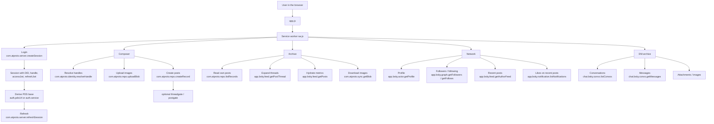

# Threadline Technical Notes

[Deutsch](TECHNICAL.de.md) | **English**

This file collects the technical background information that would otherwise overload the quick-start README.

## Interface Overview

Threadline is a static PWA without a custom backend. Most data flows go straight from the browser to the relevant Bluesky or AT Protocol endpoint. The service worker in [sw.js](sw.js) coordinates login, API access, caching, and archive logic.



## Login And Auth

### What happens during login

1. The app checks the selected service through `com.atproto.server.describeServer`.
2. It then creates a session through `com.atproto.server.createSession`.
3. Threadline stores the resulting DID, handle, and JWTs locally so reloads and long-running jobs can continue.
4. Authenticated requests try to use the logged-in account's PDS base, not blindly `bsky.social`.

The most helpful original references here are:

- [Protocol Overview](https://atproto.com/guides/overview)
- [AT Protocol Specification](https://atproto.com/specs/atp)

### Why `refreshSession` matters

- `com.atproto.server.refreshSession` is used when long archive or network runs outlive the current access token.
- This keeps archive, network, and DM jobs from failing unnecessarily during longer runs.

### Security notes

- Threadline intentionally blocks insecure `http://` PDS servers.
- App passwords and session data are stored locally because the app has no backend.
- That is convenient for a PWA, but still security-sensitive and explicitly tracked in [TODO.md](TODO.md).

## Repo Commands

These commands work directly on AT Protocol records in an account repo.

Here, `repo` does not mean a Git repository. It means the account's personal data repository in AT Protocol, which stores records such as posts, follows, likes, and related account data.

Further reading:

- [Reads and Writes](https://atproto.com/guides/reads-and-writes)
- [Reading Data](https://atproto.com/guides/reading-data)

### `com.atproto.repo.listRecords`

Used mainly by the archive workspace.

- Reads your repo in pages.
- Threadline uses it for `app.bsky.feed.post`.
- Date filters, hashtag filters, and archive content modes are built on top of that result set.

### `com.atproto.repo.getRecord`

Used when a specific record must be resolved directly.

- In the network workspace this is used for relationship metadata such as follow dates.

### `com.atproto.repo.createRecord`

Used while publishing from the composer.

- creates `app.bsky.feed.post`
- optionally creates `app.bsky.feed.threadgate`
- optionally creates `app.bsky.feed.postgate`

### `com.atproto.repo.uploadBlob`

Used for composer images.

- Images are uploaded first as blobs to the responsible PDS.
- The later post embed references those blob handles.

## Get Commands

### `app.bsky.actor.getProfile`

Loads profile basics such as:

- avatar
- display name
- handle
- follower/following counts

Used by login UI, network focus, archive metadata, and DM presentation.

### `app.bsky.graph.getFollowers`

Loads the accounts following a target account.

Used for:

- network waves
- mutual detection
- shared mutual analysis

### `app.bsky.graph.getFollows`

Loads the accounts a target account follows.

Used for:

- network waves
- mutual detection
- focused account network loading

### `app.bsky.feed.getAuthorFeed`

Loads recent posts by one actor.

Used for:

- activity summaries
- recent-post counts in focus
- media export for another actor

### `app.bsky.feed.getPosts`

Loads posts by URI batch.

Used for:

- metric hydration in the archive
- single-thread import/export
- targeted post resolution after URIs have already been collected

### `app.bsky.feed.getPostThread`

Loads the thread context for a post.

Used for:

- archive modes that expand threads
- hashtag checks at thread-root or whole-thread scope
- single-thread export

This call is protected with timeout and retry logic because it can be slow.

### `app.bsky.notification.listNotifications`

Used in Threadline for a focused best-effort signal:

- likes on a focused account's recent posts

### `chat.bsky.convo.listConvos`

Loads DM conversations.

Used for:

- DM partner lists
- DM access checks

### `chat.bsky.convo.getMessages`

Loads messages of a conversation.

Used for:

- DM archive export
- HTML and PDF DM rendering

## Identity And Blob Endpoints

### `com.atproto.identity.resolveHandle`

Resolves a handle to a DID.

Used for:

- composer mentions
- network account input
- some import and helper paths

This is still one of the places worth reviewing carefully for full host-agnostic PDS behavior.

Background reading:

- [Understanding Atproto](https://atproto.com/guides/understanding-atproto)
- [AT Protocol Specification](https://atproto.com/specs/atp)

### `com.atproto.sync.getBlob`

Loads binary assets by DID and CID.

Used for:

- archive images
- composer image restoration
- some DM attachments

## Avatars And Images

### Avatars

Avatars are used in:

- login and account UI
- network focus
- archive output
- DM archive output

Typical flow:

1. load profile through `app.bsky.actor.getProfile`
2. derive avatar URL or blob reference
3. persist it locally if the archive/export needs a local asset

### Composer images

- processed locally first
- uploaded through `com.atproto.repo.uploadBlob`
- referenced in the final post as `app.bsky.embed.images`

### Archive images

- downloaded after posts have been collected
- copied into the ZIP or embedded into HTML
- in compact HTML they can be loaded later on demand

## Link Cards

### Plain-language version

Threadline does not create automatic external link cards while composing.

### Why

Because the app is fully static and browser-only, it would have to:

- fetch third-party HTML
- parse Open Graph metadata
- fetch preview images
- construct `app.bsky.embed.external`

For the API model behind that:

- [AT Protocol XRPC API Reference](https://docs.bsky.app/docs/api/at-protocol-xrpc-api)
- [Lexicon Specification](https://atproto.com/specs/lexicon)

That fails often in practice because of cross-origin restrictions and the lack of a backend proxy.

### What still works

- clickable links through rich-text facets
- preserving already existing external card data when importing or archiving posts that already contain it

## Workspace View By Interface

### Composer

Mainly uses:

- `com.atproto.server.createSession`
- `com.atproto.identity.resolveHandle`
- `com.atproto.repo.uploadBlob`
- `com.atproto.repo.createRecord`

### Archive

Mainly uses:

- `com.atproto.repo.listRecords`
- `app.bsky.feed.getPostThread`
- `app.bsky.feed.getPosts`
- `com.atproto.sync.getBlob`

### Network

Mainly uses:

- `app.bsky.actor.getProfile`
- `app.bsky.graph.getFollowers`
- `app.bsky.graph.getFollows`
- `app.bsky.feed.getAuthorFeed`
- `app.bsky.notification.listNotifications`
- sometimes `com.atproto.repo.getRecord`

### DM archive

Mainly uses:

- `chat.bsky.convo.listConvos`
- `chat.bsky.convo.getMessages`
- attachment/image fetch paths

## PDS And Host Selection

Threadline tries to use the logged-in account's PDS for authenticated requests.

That matters for:

- custom PDS hosts outside `bsky.social`
- services such as eurosky
- archive and network requests that would otherwise hit the wrong host

So the app is much more PDS-capable than a hard-coded `bsky.social` frontend, but unusual hosts should still be tested across all four workspaces.

## Run Locally

Threadline is a static app. Any simple local web server is enough.

```powershell
python -m http.server 4173
```

Then open:

```text
http://localhost:4173
```

## Credentials And Storage Notes

- Bluesky app passwords are stored locally so sessions can be renewed and multiple logins survive reloads
- Backups include saved login entries, but not app passwords
- Session data, drafts, and app state are stored locally in IndexedDB
- No custom backend is required

## Project Structure

```text
.
├── app.js
├── index.html
├── manifest.webmanifest
├── styles.css
├── sw.js
├── translations.js
├── version.js
├── version.json
└── icons/
    ├── icon.svg
    └── maskable-icon.svg
```

## Update Detection

Threadline uses visible version checks.

- `version.js` contains the public version metadata used by the app and service worker
- the service worker fetches `version.js` with network priority
- the app checks for updates on startup
- users can manually check for updates in settings and apply a waiting update via `Reload`

When shipping changes, keep these files in sync:

- `version.js`
- `version.json` only if you keep it as an informational mirror
- cache-sensitive shell behavior in `sw.js`

## Recommended Testing

- Use a dedicated Bluesky test account, or
- create a dedicated app password just for testing

That lets you verify:

- sign-in flow
- automatic session renewal
- draft persistence
- split behavior
- manual segment editing
- saving and loading thread files
- exporting and importing backups
- images and ALT texts
- publishing
- archive filters and waves
- network focus and waves
- DM archive
- update detection

## What A PWA Is

`PWA` stands for `Progressive Web App`.

It means a web application that runs in the browser but can behave in many ways like an installable app.

For Threadline, that means:

- the app is built from HTML, CSS, and JavaScript
- it can be installed from the browser
- it uses a web app manifest for name, icons, and start behavior
- it uses a service worker for caching, background logic, and update handling

### Why Threadline uses a PWA architecture

This fits the project well because Threadline is designed to:

- work without a custom backend
- run locally on the user's device
- behave similarly on desktop and mobile
- be installable without going through an app store

So the PWA approach helps Threadline act as a lightweight, locally running Bluesky work environment.

### How it works technically

The three most important building blocks are:

1. `index.html`
   The app entry point.

2. `manifest.webmanifest`
   Describes app name, icons, colors, and launch mode so the browser can treat Threadline like an installable app.

3. `sw.js`
   The service worker. It runs alongside the page and handles tasks such as:
   - caching the app shell
   - detecting updates
   - passing messages between the UI and background logic
   - coordinating longer archive and network jobs

### Why this is useful for Threadline

Because of its PWA structure, Threadline can:

- start faster after the first load
- cache static files locally
- offer a visible reload-based update flow
- behave more like an app on mobile devices
- keep important logic in the service worker

### Limits of this architecture

The PWA approach also has clear limits:

- no custom server to bypass CORS restrictions
- no server-side secret management
- API access runs from the browser context
- local storage is practical, but security-sensitive

That is why topics like local session storage, link cards, and PDS compatibility are also architecture questions tied to the PWA design.

## Official Source Documentation

These original sources are the most useful follow-up references:

- [AT Protocol Docs](https://atproto.com/docs)
- [Protocol Overview](https://atproto.com/guides/overview)
- [Understanding Atproto](https://atproto.com/guides/understanding-atproto)
- [Reads and Writes](https://atproto.com/guides/reads-and-writes)
- [Reading Data](https://atproto.com/guides/reading-data)
- [AT Protocol Specification](https://atproto.com/specs/atp)
- [Lexicon Specification](https://atproto.com/specs/lexicon)
- [AT Protocol XRPC API Reference](https://docs.bsky.app/docs/api/at-protocol-xrpc-api)
