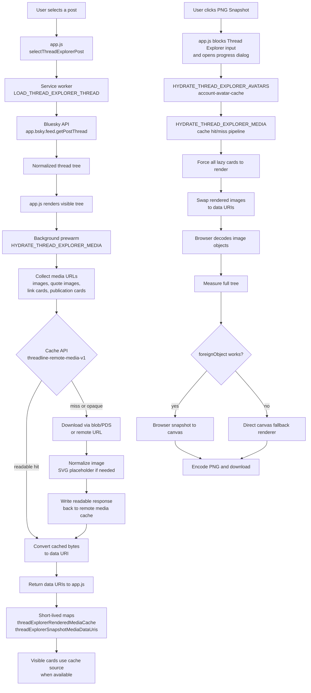

# Threadline Technical Notes

[Deutsch](TECHNICAL.de.md) | **English**

This file collects the technical background information that would otherwise overload the quick-start README.

## OpenGraph Asset Pipeline

The OpenGraph source of truth is `icons/threadline-og-workspaces.svg`. Derived raster files are generated with `npm run build:og-image` using the settings in `og-image.config.json`.

Current outputs:

- `icons/threadline-og-workspaces.png`
- `og-image.jpg`

## Interface Overview

Threadline is a static PWA without a custom backend. Most data flows go straight from the browser to the relevant Bluesky or AT Protocol endpoint. The service worker in [sw.js](sw.js) coordinates login, API access, caching, and archive logic.

```mermaid
flowchart TD
    A["User in the browser"] --> B["app.js"]
    B --> C["Service worker sw.js"]

    C --> D["Login<br/>com.atproto.server.createSession"]
    D --> E["Session with DID, handle,<br/>accessJwt, refreshJwt"]
    E --> F["Derive PDS base<br/>auth.pdsUrl or auth.service"]
    F --> G["Refresh<br/>com.atproto.server.refreshSession"]

    C --> H["Composer"]
    H --> H1["Resolve handles<br/>com.atproto.identity.resolveHandle"]
    H --> H2["Upload images<br/>com.atproto.repo.uploadBlob"]
    H --> H3["Create posts<br/>com.atproto.repo.createRecord"]
    H3 --> H4["optional threadgate / postgate"]

    C --> I["Archive"]
    I --> I1["Read own posts<br/>com.atproto.repo.listRecords"]
    I --> I2["Expand threads<br/>app.bsky.feed.getPostThread"]
    I --> I3["Hydrate metrics<br/>app.bsky.feed.getPosts"]
    I --> I4["Download images<br/>com.atproto.sync.getBlob"]

    C --> S["Search"]
    S --> S1["Global search<br/>app.bsky.feed.searchPosts"]
    S --> S2["Account posts / reposts<br/>app.bsky.feed.getAuthorFeed"]
    S --> S3["URL resolve / favorites<br/>local Thread Explorer integration"]

    C --> J["Analysis"]
    J --> J1["Profiles<br/>app.bsky.actor.getProfile"]
    J --> J2["Author feed<br/>app.bsky.feed.getAuthorFeed"]

    C --> L["Network"]
    L --> L1["Profile<br/>app.bsky.actor.getProfile"]
    L --> L2["Followers / following<br/>app.bsky.graph.getFollowers / getFollows"]
    L --> L3["Recent posts<br/>app.bsky.feed.getAuthorFeed"]
    L --> L4["Likes on recent posts<br/>app.bsky.notification.listNotifications"]

    C --> K["DM archive"]
    K --> K1["Conversations<br/>chat.bsky.convo.listConvos"]
    K --> K2["Messages<br/>chat.bsky.convo.getMessages"]
    K --> K3["Attachments / images"]
```



## Thread Explorer Cache And Snapshot Pipeline

The Thread Explorer is split between the visible browser app in [app.js](app.js) and the service worker in [sw.js](sw.js). The app owns selection state, tree rendering, lazy card hydration, zoom/pan state, and the PNG export dialog. The service worker owns authenticated Bluesky requests, thread loading, avatar hydration, media hydration, and cache access.

### Live thread loading

When a post is selected, `app.js` sends `LOAD_THREAD_EXPLORER_THREAD` to the service worker. The service worker loads the selected post through `app.bsky.feed.getPostThread`, normalizes the thread tree, and returns a root node plus post count. If the selected post is a reply inside another thread, Threadline tries to reload from the detected root and merge the selected path back into the full tree.

After the tree is rendered, the app starts a non-blocking media prewarm. This prewarm calls `HYDRATE_THREAD_EXPLORER_MEDIA` in the background. It must not delay normal thread selection: stale prewarm runs are aborted or ignored when the user selects another post.

### Media and avatar caches

Threadline uses multiple caches for different jobs:

- `account-avatar-cache` is an IndexedDB-backed app cache for account avatar assets. It stores bytes, MIME type, DID, source URL, and timestamp.
- `threadline-remote-media-v1` is the Cache API store for remote media responses used by the service worker.
- `threadExplorerRenderedMediaCache` in `app.js` is a short-lived in-memory map for the currently displayed thread. It maps media URLs to canvas-safe data URIs.
- `threadExplorerSnapshotMediaDataUris` in `app.js` is the snapshot-specific data URI map filled during PNG export.

The remote media cache can contain two kinds of entries:

- readable responses written by Threadline's own hydration path
- opaque browser image responses created by normal cross-origin image loading

Opaque responses can be replayed by the browser, but their bytes cannot be read back by JavaScript. For PNG export, only readable responses can be converted into data URIs and drawn safely into canvas.

### PNG snapshot stages

The PNG export intentionally blocks Thread Explorer input while it runs. The export changes rendered DOM state, forces all cards to hydrate, swaps images to data URIs, measures the full tree, and then draws the output. Letting the user switch threads, collapse nodes, or zoom while this is happening would invalidate the snapshot geometry.

The main stages are:

1. `app.js` opens the progress dialog and creates an abort controller.
2. `HYDRATE_THREAD_EXPLORER_AVATARS` collects all authors in the tree and ensures their avatars are in `account-avatar-cache`.
3. `HYDRATE_THREAD_EXPLORER_MEDIA` collects post images, quoted-post images, link-card thumbnails, and publication-card thumbnails.
4. For each media URL, the service worker checks `threadline-remote-media-v1`.
5. On cache hit, readable bytes are converted directly to a data URI.
6. On cache miss, the service worker downloads the asset through blob resolution when possible, normalizes SVGs to a PNG placeholder, writes the readable response back to `threadline-remote-media-v1`, and returns a data URI.
7. `app.js` stores returned data URIs in the short-lived media maps.
8. The app forces all lazy Thread Explorer cards to render once.
9. Rendered images are swapped to data URIs and checked by the browser image decoder.
10. The complete tree is measured and exported through the browser `foreignObject` path when possible.
11. If `foreignObject` is not supported for the current tree, Threadline falls back to the direct canvas renderer.

### Cache hit and miss progress

During media hydration, the service worker reports:

- `current` / `total`
- `remaining`
- `hydrated`
- `skipped`
- `cacheHits`
- `downloaded`

This lets the UI distinguish between a slow network run and a mostly cached export. A healthy repeated export of the same thread should show many cache hits and fewer newly downloaded assets. If `downloaded` remains high after a previous full export, the likely causes are expired browser storage, cache eviction, opaque-only image entries, changed CDN URLs, or media URLs that failed normalization.

### Flow



## PowerShell Archiver

For large account archives, Threadline now has a two-part direction:

- the browser PWA remains the interactive UI
- a standalone PowerShell archiver handles long-running bulk fetches

The key design constraint is compatibility:

**The PowerShell archiver must emit the same archive JSON contract that the browser app already exports today.**

That means:

- the same `manifest.json` / `posts.json` structure
- the same asset folder conventions
- ZIP output that can still be imported back into Threadline
- compatibility with `scripts/convert-threadline-archive-to-html.ps1`

A dedicated script and note for that tool live in:

- `scripts/archive-threadline.ps1`
- `scripts/README.threadline-archiver.md`

## Search Workspace Internals

The search workspace deliberately combines two strategies:

- direct server-side search through `app.bsky.feed.searchPosts`
- local feed scanning through `app.bsky.feed.getAuthorFeed`

This split exists because the built-in Bluesky search API is strong for global discovery, but not enough for all of Threadline's search modes and filters.

### Search modes

- `Network search`
  - uses `app.bsky.feed.searchPosts`
  - best for global topic search, account-scoped global search, hashtag search, and URL/domain filters
- `Posts of one account`
  - walks `app.bsky.feed.getAuthorFeed`
  - lets Threadline inspect one account's posts even when the global search index is incomplete
- `Reposts of one account`
  - also walks `app.bsky.feed.getAuthorFeed`
  - keeps only entries whose feed reason is `reasonRepost`
- `Hashtag search`
  - starts from `app.bsky.feed.searchPosts`
  - can switch between documented AND-style tag matching and Threadline's own `at least one hashtag` mode

### Why local filtering exists

The Bluesky API does not expose every UI filter as one server-side parameter. Threadline therefore applies a second filtering pass in `sw.js` after loading results.

Typical local filters are:

- exclude text
- post type such as originals, replies, quotes, reposts, or non-reposts
- posts without media
- mention checks
- multi-language merging
- account-feed-only scans
- `any hashtag` matching across several API variants

### Multi-language and hashtag variants

When the user selects more than one language, Threadline runs multiple `searchPosts` requests and merges the pages locally. The same happens for `at least one hashtag`:

- Bluesky documents multiple `tag` parameters as AND matching
- Threadline emulates OR matching by running one search variant per tag and deduplicating the returned post URIs

This is why the search workspace keeps its own cursor state in addition to the plain API cursor.

## Login And Auth

### What happens during login

1. The app checks the selected service through `com.atproto.server.describeServer`.
2. It then creates a session through `com.atproto.server.createSession`.
3. Threadline stores the resulting DID, handle, and JWTs locally so reloads and long-running jobs can continue.
4. Authenticated requests try to use the logged-in account's PDS base, not blindly `bsky.social`.

The most helpful original references here are:

- [Protocol Overview](https://atproto.com/guides/overview)
- [AT Protocol Specification](https://atproto.com/specs/atp)

### Why `refreshSession` matters

- `com.atproto.server.refreshSession` is used when long archive or network runs outlive the current access token.
- This keeps archive, network, and DM jobs from failing unnecessarily during longer runs.

### Security notes

- Threadline intentionally blocks insecure `http://` PDS servers.
- App passwords and session data are stored locally because the app has no backend.
- That is convenient for a PWA, but still security-sensitive and explicitly tracked in [TODO.md](TODO.md).

## Repo Commands

These commands work directly on AT Protocol records in an account repo.

Here, `repo` does not mean a Git repository. It means the account's personal data repository in AT Protocol, which stores records such as posts, follows, likes, and related account data.

Further reading:

- [Reads and Writes](https://atproto.com/guides/reads-and-writes)
- [Reading Data](https://atproto.com/guides/reading-data)

### `com.atproto.repo.listRecords`

Used mainly by the archive workspace.

- Reads your repo in pages.
- Threadline uses it for `app.bsky.feed.post`.
- Date filters, hashtag filters, and archive content modes are built on top of that result set.

### `com.atproto.repo.getRecord`

Used when a specific record must be resolved directly.

- In the network workspace this is used for relationship metadata such as follow dates.

### `com.atproto.repo.createRecord`

Used while publishing from the composer.

- creates `app.bsky.feed.post`
- optionally creates `app.bsky.feed.threadgate`
- optionally creates `app.bsky.feed.postgate`

### `com.atproto.repo.uploadBlob`

Used for composer images.

- Images are uploaded first as blobs to the responsible PDS.
- The later post embed references those blob handles.

## Get Commands

### `app.bsky.actor.getProfile`

Loads profile basics such as:

- avatar
- display name
- handle
- follower/following counts

Used by login UI, network focus, archive metadata, and DM presentation.

Also used by:

- the analysis workspace to load the profile basis for both compared accounts

### `app.bsky.graph.getFollowers`

Loads the accounts following a target account.

Used for:

- network waves
- mutual detection
- shared mutual analysis

### `app.bsky.graph.getFollows`

Loads the accounts a target account follows.

Used for:

- network waves
- mutual detection
- focused account network loading

### `app.bsky.feed.getAuthorFeed`

Loads recent posts by one actor.

Used for:

- activity summaries
- recent-post counts in focus
- media export for another actor
- loading the post basis for the analysis workspace

## Analysis Workspace Internals

The analysis workspace loads a slice of the author feed for two accounts and calculates two groups of signals:

- language-focused signals
- temporal signals
- network and interaction signals

The result is intentionally heuristic. It is not an identity verdict, only an additional indicator.

### Language-focused signals

Threadline currently combines at least these methods:

- a metrics profile built from averages such as word length, sentence length, emoji rate, and uppercase rate
- cosine similarity over word distributions
- Jaccard similarity over word sets
- function-word profile
- character n-grams
- Burrows's Delta

### Temporal signals

In addition, Threadline derives a temporal profile from:

- hour-of-day distribution
- weekday distribution
- pause/burst profile between posts of the same account
- temporal proximity of both accounts inside small windows

These signals power weekly heatmaps, 30-day activity timelines, and two extra comparison values:

- `Temporal profile score`
- `Temporal proximity`

### Network and interaction signals

Threadline now also compares:

- shared followers
- shared follows
- shared mutuals
- direct relation between account A and B
- mention targets
- linked domains
- hashtags
- reply targets
- quote targets
- language tags
- media-share tendencies

Mutes and blocks are only comparable when the corresponding compared accounts are available as stored Threadline accounts, because Bluesky exposes those moderation lists only for the authenticated account.

### Methods And Sources

#### Cosine similarity

Threadline compares frequency vectors with the cosine of the enclosed angle.

Core idea:

`cos(theta) = (A · B) / (||A|| ||B||)`

Useful source:

- Salton, G.; McGill, M. J. *Introduction to Modern Information Retrieval*. McGraw-Hill, 1983.

#### Jaccard similarity

For word sets, Threadline compares overlap relative to the union.

Core idea:

`J(A, B) = |A ∩ B| / |A ∪ B|`

Historical source:

- Jaccard, P. "Étude comparative de la distribution florale dans une portion des Alpes et des Jura." *Bulletin de la Société Vaudoise des Sciences Naturelles* 37, 1901, pp. 547–579.

#### Burrows's Delta

Burrows's Delta is a classic stylometric distance over z-normalized frequencies of common words. Threadline derives a cautious similarity component from it for the overall score.

Foundational source:

- Burrows, J. F. "'Delta': a Measure of Stylistic Difference and a Guide to Likely Authorship." *Literary and Linguistic Computing* 17(3), 2002, pp. 267–287.

#### Character n-grams

Character n-grams capture repeated character sequences and therefore spelling habits, endings, and orthographic preferences.

A commonly cited overview:

- Stamatatos, E. "A Survey of Modern Authorship Attribution Methods." *Journal of the American Society for Information Science and Technology* 60(3), 2009, pp. 538–556.

#### Function words

Function words are useful in stylometry because they are often less topic-dependent than content words.

Classic source:

- Mosteller, F.; Wallace, D. L. *Inference and Disputed Authorship: The Federalist*. Addison-Wesley, 1964.

#### Temporal profile and temporal proximity

The temporal features in Threadline are currently not a single literature-derived formula. They are a pragmatic in-product combination of histogram similarity and small-window activity proximity.

For context on related forensic and behavioral approaches:

- Grant, T. *Analyzing Language in Context: A Reader in Forensic Linguistics*. Routledge, 2010.
- Stamatatos, E. "Author Identification: Using Text Sampling to Handle the Class Imbalance Problem." *Information Processing and Management* 44(2), 2008, pp. 790–799.

### Robustness mix

The current overall score is deliberately a blend, not a single truth metric.

At the moment, the approximate weights are:

- Burrows's Delta: 22%
- character n-grams: 22%
- function-word profile: 17%
- cosine similarity: 14%
- Jaccard similarity: 7%
- metrics profile: 8%
- temporal profile: 6%
- temporal proximity: 4%

These weights are product choices, not directly copied from one scientific source.

### `app.bsky.feed.getPosts`

Loads posts by URI batch.

Used for:

- metric hydration in the archive
- single-thread import/export
- targeted post resolution after URIs have already been collected

Important:

- the analysis workspace does **not** currently use this call. Analysis currently reads directly from `app.bsky.feed.getAuthorFeed`.

### `app.bsky.feed.getPostThread`

Loads the thread context for a post.

Used for:

- archive modes that expand threads
- hashtag checks at thread-root or whole-thread scope
- single-thread export
- resolving reply targets and thread continuation targets from a post URL

Important:

- the analysis workspace does **not** currently use this call.

This call is protected with timeout and retry logic because it can be slow.

## Replies And Thread Continuation Internals

Both features start from a post URL, but they intentionally resolve to different reply references.

### Reply To Post URL

- The URL is parsed and first resolved through `app.bsky.feed.getPosts`
- Then `app.bsky.feed.getPostThread` loads the surrounding thread context
- For the first new segment, Threadline sets `reply.root` to the thread root
- `reply.parent` points to the exact post from the supplied URL
- Threadgate rules are checked on a best-effort basis before publishing; clearly blocked replies fail early

### Continue Thread

- The URL is also resolved to a specific post and then to the full thread
- Threadline then searches that thread for the latest own post of the currently active account
- `reply.root` stays the thread root
- But `reply.parent` is intentionally set to that latest own post, not to the post from the URL
- This continues your own thread cleanly instead of accidentally replying in the middle of an older branch

### Persistence And Publish Behavior

- The resolved target is stored inside the composer draft in `IndexedDB`, so it survives reloads
- `app.js` keeps the richer target card data for the UI
- During actual publishing, only normalized `replyRoot` and `replyParent` references are passed to `sw.js`
- Those references are applied to the first new segment; any following segments then chain normally from there

### `app.bsky.notification.listNotifications`

Used in Threadline for a focused best-effort signal:

- likes on a focused account's recent posts

### `chat.bsky.convo.listConvos`

Loads DM conversations.

Used for:

- DM partner lists
- DM access checks

### `chat.bsky.convo.getMessages`

Loads messages of a conversation.

Used for:

- DM archive export
- HTML and PDF DM rendering

## Identity And Blob Endpoints

### `com.atproto.identity.resolveHandle`

Resolves a handle to a DID.

Used for:

- composer mentions
- network account input
- some import and helper paths

This is still one of the places worth reviewing carefully for full host-agnostic PDS behavior.

Background reading:

- [Understanding Atproto](https://atproto.com/guides/understanding-atproto)
- [AT Protocol Specification](https://atproto.com/specs/atp)

### `com.atproto.sync.getBlob`

Loads binary assets by DID and CID.

Used for:

- archive images
- composer image restoration
- some DM attachments

## Avatars And Images

### Avatars

Avatars are used in:

- login and account UI
- network focus
- archive output
- DM archive output

Typical flow:

1. load profile through `app.bsky.actor.getProfile`
2. derive avatar URL or blob reference
3. persist it locally if the archive/export needs a local asset

### Composer images

- processed locally first
- uploaded through `com.atproto.repo.uploadBlob`
- referenced in the final post as `app.bsky.embed.images`

### Archive images

- downloaded after posts have been collected
- copied into the ZIP or embedded into HTML
- in compact HTML they can be loaded later on demand

## Link Cards

### Plain-language version

Threadline does not create automatic external link cards while composing.

### Why

Because the app is fully static and browser-only, it would have to:

- fetch third-party HTML
- parse Open Graph metadata
- fetch preview images
- construct `app.bsky.embed.external`

For the API model behind that:

- [AT Protocol XRPC API Reference](https://docs.bsky.app/docs/api/at-protocol-xrpc-api)
- [Lexicon Specification](https://atproto.com/specs/lexicon)

That fails often in practice because of cross-origin restrictions and the lack of a backend proxy.

### What still works

- clickable links through rich-text facets
- preserving already existing external card data when importing or archiving posts that already contain it

## Workspace View By Interface

### Composer

Mainly uses:

- `com.atproto.server.createSession`
- `com.atproto.identity.resolveHandle`
- `com.atproto.repo.uploadBlob`
- `com.atproto.repo.createRecord`
- `app.bsky.feed.getPosts`
- `app.bsky.feed.getPostThread`

### Archive

Mainly uses:

- `com.atproto.repo.listRecords`
- `app.bsky.feed.getPostThread`
- `app.bsky.feed.getPosts`
- `com.atproto.sync.getBlob`

### Analysis

Mainly uses:

- `app.bsky.actor.getProfile`
- `app.bsky.feed.getAuthorFeed`

### Network

Mainly uses:

- `app.bsky.actor.getProfile`
- `app.bsky.graph.getFollowers`
- `app.bsky.graph.getFollows`
- `app.bsky.feed.getAuthorFeed`
- `app.bsky.notification.listNotifications`
- sometimes `com.atproto.repo.getRecord`

### DM archive

Mainly uses:

- `chat.bsky.convo.listConvos`
- `chat.bsky.convo.getMessages`
- attachment/image fetch paths

## PDS And Host Selection

Threadline tries to use the logged-in account's PDS for authenticated requests.

That matters for:

- custom PDS hosts outside `bsky.social`
- services such as eurosky
- archive and network requests that would otherwise hit the wrong host

So the app is much more PDS-capable than a hard-coded `bsky.social` frontend, but unusual hosts should still be tested across all five workspaces.

## Run Locally

Threadline is a static app. Any simple local web server is enough.

```powershell
python -m http.server 4173
```

Then open:

```text
http://localhost:4173
```

## Credentials And Storage Notes

- Bluesky app passwords are stored locally so sessions can be renewed and multiple logins survive reloads
- Backups include saved login entries, but not app passwords
- Session data, drafts, and app state are stored locally in IndexedDB
- No custom backend is required

## Project Structure

```text
.
├── app.js
├── index.html
├── manifest.webmanifest
├── styles.css
├── sw.js
├── translations.js
├── version.js
├── version.json
└── icons/
    ├── icon.svg
    └── maskable-icon.svg
```

## Update Detection

Threadline uses visible version checks.

- `version.js` contains the public version metadata used by the app and service worker
- the service worker fetches `version.js` with network priority
- the app checks for updates on startup
- users can manually check for updates in settings and apply a waiting update via `Reload`

When shipping changes, keep these files in sync:

- `version.js`
- `version.json` only if you keep it as an informational mirror
- cache-sensitive shell behavior in `sw.js`

## Recommended Testing

- Use a dedicated Bluesky test account, or
- create a dedicated app password just for testing

That lets you verify:

- sign-in flow
- automatic session renewal
- draft persistence
- split behavior
- manual segment editing
- saving and loading thread files
- exporting and importing backups
- images and ALT texts
- publishing
- archive filters and waves
- network focus and waves
- DM archive
- update detection

## What A PWA Is

`PWA` stands for `Progressive Web App`.

It means a web application that runs in the browser but can behave in many ways like an installable app.

For Threadline, that means:

- the app is built from HTML, CSS, and JavaScript
- it can be installed from the browser
- it uses a web app manifest for name, icons, and start behavior
- it uses a service worker for caching, background logic, and update handling

### Why Threadline uses a PWA architecture

This fits the project well because Threadline is designed to:

- work without a custom backend
- run locally on the user's device
- behave similarly on desktop and mobile
- be installable without going through an app store

So the PWA approach helps Threadline act as a lightweight, locally running Bluesky work environment.

### How it works technically

The three most important building blocks are:

1. `index.html`
   The app entry point.

2. `manifest.webmanifest`
   Describes app name, icons, colors, and launch mode so the browser can treat Threadline like an installable app.

3. `sw.js`
   The service worker. It runs alongside the page and handles tasks such as:
   - caching the app shell
   - detecting updates
   - passing messages between the UI and background logic
   - coordinating longer archive and network jobs

### Why this is useful for Threadline

Because of its PWA structure, Threadline can:

- start faster after the first load
- cache static files locally
- offer a visible reload-based update flow
- behave more like an app on mobile devices
- keep important logic in the service worker

### Limits of this architecture

The PWA approach also has clear limits:

- no custom server to bypass CORS restrictions
- no server-side secret management
- API access runs from the browser context
- local storage is practical, but security-sensitive

That is why topics like local session storage, link cards, and PDS compatibility are also architecture questions tied to the PWA design.

## Official Source Documentation

These original sources are the most useful follow-up references:

- [AT Protocol Docs](https://atproto.com/docs)
- [Protocol Overview](https://atproto.com/guides/overview)
- [Understanding Atproto](https://atproto.com/guides/understanding-atproto)
- [Reads and Writes](https://atproto.com/guides/reads-and-writes)
- [Reading Data](https://atproto.com/guides/reading-data)
- [AT Protocol Specification](https://atproto.com/specs/atp)
- [Lexicon Specification](https://atproto.com/specs/lexicon)
- [AT Protocol XRPC API Reference](https://docs.bsky.app/docs/api/at-protocol-xrpc-api)
